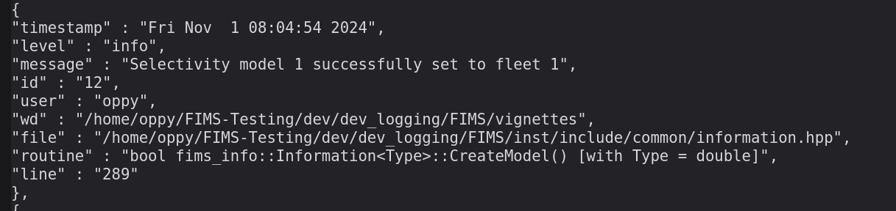

# Introducing the FIMS Logging System

## Importance of Logging

Logging in FIMS is important because it allows developers to understand
what is happening within a model. It is especially useful when problems
arise. The FIMS logging system has been designed to handle common
issues, such as undefined modules, dimension issues, and software errors
that may occur when a model is not properly defined. This logging system
is accessible from both R and C++ and messages are provided using a JSON
format.

## How FIMS Logging works

At run time, logging messages are stored in a C++ structure called
LogEntry in inst/include/common/def.hpp. This structure contains useful
information, such as information regarding when the LogEntry was created
and what portion of the code initiated its creation. For details
regarding the contents of a LogEntry see the doxygen documentation. All
of the LogEntry(s) are stored in a log file that can be accessed from
within your R environment or written to the disk. Additionally, this
file can automatically be written to the disk when R fails to
successfully communicate with C++.

## Backend C++ Specification

The logging system (specified in inst/include/common/def.hpp) provides
three useful macro functions for creating log entries, `FIMS_INFO_LOG`,
`FIMS_WARNING_LOG`, and `FIMS_ERROR_LOG`. These macros take a single
string value as an argument, the rest is handled internally. Therefore,
the developer only needs to worry about specifying the message and the
macros take care of capturing all the other elements of the log entry.
For example, `FIMS_INFO_LOG` is used quite a bit in information.hpp to
let the user know that items were initialized appropriately. Developers
can specify the information contained within the string passed to the
macro to be generic or specific to values stored inside the C++ code.
See below for an example of a generic message that is completely
specified by the user and a more specific message that uses information
stored within C++ for part of the message. Also, note that the C++
function `fims::to_string` converts a numeric value to a string, making
it additive to the message.

``` cpp
FIMS_INFO_LOG("Starting to initialize the fleet structures")
FIMS_INFO_LOG("Initializing fleet " + fims::to_string(f->id))
```

Below is a real-world example of a log entry that was created while
running a FIMS model due to `FIMS_INFO_LOG` within [selectivity in
information.hpp](https://github.com/NOAA-FIMS/FIMS/blob/main/inst/include/common/information.hpp#L371).
The log entry specifies the line of the file with the macro that led to
the log entry. The screenshot below shows what the user would see if
this log entry were invoked.



Example of a log entry.

Additionally, if FIMS has been compiled with the `-DFIMS_DEBUG`
pre-processing macro, output from the `FIMS_DEBUG_LOG` macro will also
be available in the log file, allowing developers a more interactive
developing experience. The output from this macro is turned off in the
main branch, and thus, the macro is not available to the typical user to
stop debugging statements from polluting the log file.

## Using the Logging System in R

The FIMS Logging System is also available from R, with a caveat! Logging
from R gives less information than logging from C++. When a log entry
originates from R, file, routine, and line information are absent.
Further implementations may rectify this issue. Below are examples of
adding log entries from R.

``` r
log_info("info entry from R script")
log_warning("warning entry from R script")
```

``` r
error <- log_error("error entry from R script")
```

    ## before call.after call.

``` r
get_log_errors()
```

    ## [1] "[\n{\n\"timestamp\": \"Fri Jan 16 23:49:47 2026\",\n\"level\": \"error\",\n\"message\": \"error entry from R script\",\n\"id\": \"0\",\n\"user\": \"runner\",\n\"wd\": \"/home/runner/work/FIMS/FIMS/vignettes\",\n\"file\": \"/home/runner/work/FIMS/FIMS/vignettes/R_env\",\n\"routine\": \"traceback: 42: .External(list(name = \\\"InternalFunction_invoke\\\", address = <pointer: 0x55bae3fd0e40>, \\n        dll = list(name = \\\"Rcpp\\\", path = \\\"/home/runner/work/_temp/Library/Rcpp/libs/Rcpp.so\\\", \\n            dynamicLookup = TRUE, handle = <pointer: 0x55bae6f74030>, \\n            info = <pointer: 0x55bae38c8d20>, forceSymbols = FALSE), \\n        numParameters = -1L), <pointer: 0x55baea1d7f50>, ...)\\n41: log_error(\\\"error entry from R script\\\")\\n40: eval(expr, envir)\\n39: eval(expr, envir)\\n38: withVisible(eval(expr, envir))\\n37: withCallingHandlers(code, error = function (e) \\n    rlang::entrace(e), message = function (cnd) \\n    {\\n        watcher$capture_plot_and_output()\\n        if (on_message$capture) {\\n            watcher$push(cnd)\\n        }\\n        if (on_message$silence) {\\n            invokeRestart(\\\"muffleMessage\\\")\\n        }\\n    }, warning = function (cnd) \\n    {\\n        if (getOption(\\\"warn\\\") >= 2 || getOption(\\\"warn\\\") < 0) {\\n            return()\\n        }\\n        watcher$capture_plot_and_output()\\n        if (on_warning$capture) {\\n            cnd <- sanitize_call(cnd)\\n            watcher$push(cnd)\\n        }\\n        if (on_warning$silence) {\\n            invokeRestart(\\\"muffleWarning\\\")\\n        }\\n    }, error = function (cnd) \\n    {\\n        watcher$capture_plot_and_output()\\n        cnd <- sanitize_call(cnd)\\n        watcher$push(cnd)\\n        switch(on_error, continue = invokeRestart(\\\"eval_continue\\\"), \\n            stop = invokeRestart(\\\"eval_stop\\\"), error = NULL)\\n    })\\n36: eval(call)\\n35: eval(call)\\n34: with_handlers({\\n        for (expr in tle$exprs) {\\n            ev <- withVisible(eval(expr, envir))\\n            watcher$capture_plot_and_output()\\n            watcher$print_value(ev$value, ev$visible, envir)\\n        }\\n        TRUE\\n    }, handlers)\\n33: doWithOneRestart(return(expr), restart)\\n32: withOneRestart(expr, restarts[[1L]])\\n31: withRestartList(expr, restarts[-nr])\\n30: doWithOneRestart(return(expr), restart)\\n29: withOneRestart(withRestartList(expr, restarts[-nr]), restarts[[nr]])\\n28: withRestartList(expr, restarts)\\n27: withRestarts(with_handlers({\\n        for (expr in tle$exprs) {\\n            ev <- withVisible(eval(expr, envir))\\n            watcher$capture_plot_and_output()\\n            watcher$print_value(ev$value, ev$visible, envir)\\n        }\\n        TRUE\\n    }, handlers), eval_continue = function() TRUE, eval_stop = function() FALSE)\\n26: evaluate::evaluate(...)\\n25: evaluate(code, envir = env, new_device = FALSE, keep_warning = if (is.numeric(options$warning)) TRUE else options$warning, \\n        keep_message = if (is.numeric(options$message)) TRUE else options$message, \\n        stop_on_error = if (is.numeric(options$error)) options$error else {\\n            if (options$error && options$include) \\n                0L\\n            else 2L\\n        }, output_handler = knit_handlers(options$render, options))\\n24: in_dir(input_dir(), expr)\\n23: in_input_dir(evaluate(code, envir = env, new_device = FALSE, \\n        keep_warning = if (is.numeric(options$warning)) TRUE else options$warning, \\n        keep_message = if (is.numeric(options$message)) TRUE else options$message, \\n        stop_on_error = if (is.numeric(options$error)) options$error else {\\n            if (options$error && options$include) \\n                0L\\n            else 2L\\n        }, output_handler = knit_handlers(options$render, options)))\\n22: eng_r(options)\\n21: block_exec(params)\\n20: call_block(x)\\n19: process_group(group)\\n18: withCallingHandlers(if (tangle) process_tangle(group) else process_group(group), \\n        error = function(e) {\\n            if (progress && is.function(pb$interrupt)) \\n                pb$interrupt()\\n            if (is_R_CMD_build() || is_R_CMD_check()) \\n                error <<- format(e)\\n        })\\n17: with_options(withCallingHandlers(if (tangle) process_tangle(group) else process_group(group), \\n        error = function(e) {\\n            if (progress && is.function(pb$interrupt)) \\n                pb$interrupt()\\n            if (is_R_CMD_build() || is_R_CMD_check()) \\n                error <<- format(e)\\n        }), list(rlang_trace_top_env = knit_global()))\\n16: xfun:::handle_error(with_options(withCallingHandlers(if (tangle) process_tangle(group) else process_group(group), \\n        error = function(e) {\\n            if (progress && is.function(pb$interrupt)) \\n                pb$interrupt()\\n            if (is_R_CMD_build() || is_R_CMD_check()) \\n                error <<- format(e)\\n        }), list(rlang_trace_top_env = knit_global())), function(loc) {\\n        setwd(wd)\\n        write_utf8(res, output %n% stdout())\\n        paste0(\\\"\\nQuitting from \\\", loc, if (!is.null(error)) \\n            paste0(\\\"\\n\\\", rule(), error, \\\"\\n\\\", rule()))\\n    }, if (labels[i] != \\\"\\\") sprintf(\\\" [%s]\\\", labels[i]), get_loc)\\n15: process_file(text, output)\\n14: knitr::knit(knit_input, knit_output, envir = envir, quiet = quiet)\\n13: rmarkdown::render(envir = globalenv(), ...)\\n12: (function (..., seed = NULL) \\n    {\\n        if (!is.null(seed)) {\\n            set.seed(seed)\\n            if (requireNamespace(\\\"htmlwidgets\\\", quietly = TRUE)) {\\n                htmlwidgets::setWidgetIdSeed(seed)\\n            }\\n        }\\n        options(knitr.graphics.rel_path = FALSE)\\n        rmarkdown::render(envir = globalenv(), ...)\\n    })(input = base::quote(\\\"/home/runner/work/FIMS/FIMS/vignettes/fims-logging.Rmd\\\"), \\n        output_file = base::quote(\\\"fims-logging.html\\\"), output_dir = base::quote(\\\"/home/runner/work/FIMS/FIMS/docs/articles\\\"), \\n        intermediates_dir = base::quote(\\\"/tmp/RtmpynZ32f\\\"), encoding = base::quote(\\\"UTF-8\\\"), \\n        seed = base::quote(1014L), output_format = base::quote(list(\\n            knitr = list(opts_knit = NULL, opts_chunk = list(dev = \\\"ragg_png\\\", \\n                dpi = 96L, fig.width = 7.29166666666667, fig.height = 4.50659250103008, \\n                fig.retina = 2L, dev.args = list(bg = NA), fig.ext = \\\"png\\\", \\n                other.parameters = list(), fig.class = \\\"r-plt\\\"), \\n                knit_hooks = list(plot = function (x, options) \\n                {\\n                    hook_output <- knitr::hook_plot_md(x, options)\\n                    if (!is.null(options$fig.class)) {\\n                      hook_output <- gsub(\\\"<img src=\\\\\"([^\\\\\"]+)\\\\\"\\\", \\n                        sprintf(\\\"<img src=\\\\\"\\\\1\\\\\" class=\\\\\"%s\\\\\"\\\", \\n                          options$fig.class), hook_output)\\n                    }\\n                    hook_output\\n                }), opts_hooks = NULL, opts_template = NULL), pandoc = list(\\n                to = \\\"html\\\", from = \\\"markdown+autolink_bare_uris+tex_math_single_backslash\\\", \\n                args = c(\\\"--standalone\\\", \\\"--section-divs\\\", \\\"--template\\\", \\n                \\\"/tmp/RtmpynZ32f/pkgdown-rmd-template-20bf3b01a02e.html\\\", \\n                \\\"--highlight-style\\\", \\\"pygments\\\"), keep_tex = FALSE, \\n                latex_engine = \\\"pdflatex\\\", ext = NULL, convert_fun = NULL, \\n                lua_filters = c(\\\"/home/runner/work/_temp/Library/rmarkdown/rmarkdown/lua/pagebreak.lua\\\", \\n                \\\"/home/runner/work/_temp/Library/rmarkdown/rmarkdown/lua/latex-div.lua\\\"\\n                )), keep_md = FALSE, clean_supporting = FALSE, df_print = \\\"default\\\", \\n            pre_knit = function (...) \\n            {\\n                options(width = width)\\n                if (is.function(old_pre)) {\\n                    old_pre(...)\\n                }\\n            }, post_knit = function (...) \\n            {\\n                op(base(...), overlay(...))\\n            }, pre_processor = function (...) \\n            {\\n                op(base(...), overlay(...))\\n            }, intermediates_generator = function (original_input, \\n                intermediates_dir) \\n            {\\n                copy_render_intermediates(original_input, intermediates_dir, \\n                    !self_contained)\\n            }, post_processor = function (metadata, input_file, output_file, \\n                ...) \\n            {\\n                original_output_file <- output_file\\n                output_file <- overlay(metadata, input_file, output_file, \\n                    ...)\\n                if (!is.null(attr(output_file, \\\"post_process_original\\\"))) \\n                    base(metadata, input_file, original_output_file, \\n                      ...)\\n                base(metadata, input_file, output_file, ...)\\n            }, file_scope = NULL, on_exit = function () \\n            {\\n                if (is.function(base)) \\n                    base()\\n                if (is.function(overlay)) \\n                    overlay()\\n            })), output_options = base::quote(NULL), quiet = base::quote(TRUE))\\n11: (function (what, args, quote = FALSE, envir = parent.frame()) \\n    {\\n        if (!is.list(args)) \\n            stop(\\\"second argument must be a list\\\")\\n        if (quote) \\n            args <- lapply(args, enquote)\\n        .Internal(do.call(what, args, envir))\\n    })(base::quote(function (..., seed = NULL) \\n    {\\n        if (!is.null(seed)) {\\n            set.seed(seed)\\n            if (requireNamespace(\\\"htmlwidgets\\\", quietly = TRUE)) {\\n                htmlwidgets::setWidgetIdSeed(seed)\\n            }\\n        }\\n        options(knitr.graphics.rel_path = FALSE)\\n        rmarkdown::render(envir = globalenv(), ...)\\n    }), base::quote(list(input = \\\"/home/runner/work/FIMS/FIMS/vignettes/fims-logging.Rmd\\\", \\n        output_file = \\\"fims-logging.html\\\", output_dir = \\\"/home/runner/work/FIMS/FIMS/docs/articles\\\", \\n        intermediates_dir = \\\"/tmp/RtmpynZ32f\\\", encoding = \\\"UTF-8\\\", \\n        seed = 1014L, output_format = list(knitr = list(opts_knit = NULL, \\n            opts_chunk = list(dev = \\\"ragg_png\\\", dpi = 96L, fig.width = 7.29166666666667, \\n                fig.height = 4.50659250103008, fig.retina = 2L, dev.args = list(\\n                    bg = NA), fig.ext = \\\"png\\\", other.parameters = list(), \\n                fig.class = \\\"r-plt\\\"), knit_hooks = list(plot = function (x, \\n                options) \\n            {\\n                hook_output <- knitr::hook_plot_md(x, options)\\n                if (!is.null(options$fig.class)) {\\n                    hook_output <- gsub(\\\"), \\n        quote = base::quote(TRUE))\\n10: base::do.call(base::do.call, base::c(base::readRDS(\\\"/tmp/RtmpynZ32f/callr-fun-20bf5e7236e0\\\"), \\n        base::list(envir = .GlobalEnv, quote = TRUE)), envir = .GlobalEnv, \\n        quote = TRUE)\\n9: base::saveRDS(base::do.call(base::do.call, base::c(base::readRDS(\\\"/tmp/RtmpynZ32f/callr-fun-20bf5e7236e0\\\"), \\n       base::list(envir = .GlobalEnv, quote = TRUE)), envir = .GlobalEnv, \\n       quote = TRUE), file = \\\"/tmp/RtmpynZ32f/callr-res-20bf49d4cd3a\\\", \\n       compress = FALSE)\\n8: base::withCallingHandlers({\\n       NULL\\n       base::saveRDS(base::do.call(base::do.call, base::c(base::readRDS(\\\"/tmp/RtmpynZ32f/callr-fun-20bf5e7236e0\\\"), \\n           base::list(envir = .GlobalEnv, quote = TRUE)), envir = .GlobalEnv, \\n           quote = TRUE), file = \\\"/tmp/RtmpynZ32f/callr-res-20bf49d4cd3a\\\", \\n           compress = FALSE)\\n       base::flush(base::stdout())\\n       base::flush(base::stderr())\\n       NULL\\n       base::invisible()\\n   }, error = function(e) {\\n       {\\n           callr_data <- base::as.environment(\\\"tools:callr\\\")$`__callr_data__`\\n           err <- callr_data$err\\n           if (FALSE) {\\n               base::assign(\\\".Traceback\\\", base::.traceback(4), envir = callr_data)\\n               utils::dump.frames(\\\"__callr_dump__\\\")\\n               base::assign(\\\".Last.dump\\\", .GlobalEnv$`__callr_dump__`, \\n                   envir = callr_data)\\n               base::rm(\\\"__callr_dump__\\\", envir = .GlobalEnv)\\n           }\\n           e <- err$process_call(e)\\n           e2 <- err$new_error(\\\"error in callr subprocess\\\")\\n           class <- base::class\\n           class(e2) <- base::c(\\\"callr_remote_error\\\", class(e2))\\n           e2 <- err$add_trace_back(e2)\\n           cut <- base::which(e2$trace$scope == \\\"global\\\")[1]\\n           if (!base::is.na(cut)) {\\n               e2$trace <- e2$trace[-(1:cut), ]\\n           }\\n           base::saveRDS(base::list(\\\"error\\\", e2, e), file = base::paste0(\\\"/tmp/RtmpynZ32f/callr-res-20bf49d4cd3a\\\", \\n               \\\".error\\\"))\\n       }\\n   }, interrupt = function(e) {\\n       {\\n           callr_data <- base::as.environment(\\\"tools:callr\\\")$`__callr_data__`\\n           err <- callr_data$err\\n           if (FALSE) {\\n               base::assign(\\\".Traceback\\\", base::.traceback(4), envir = callr_data)\\n               utils::dump.frames(\\\"__callr_dump__\\\")\\n               base::assign(\\\".Last.dump\\\", .GlobalEnv$`__callr_dump__`, \\n                   envir = callr_data)\\n               base::rm(\\\"__callr_dump__\\\", envir = .GlobalEnv)\\n           }\\n           e <- err$process_call(e)\\n           e2 <- err$new_error(\\\"error in callr subprocess\\\")\\n           class <- base::class\\n           class(e2) <- base::c(\\\"callr_remote_error\\\", class(e2))\\n           e2 <- err$add_trace_back(e2)\\n           cut <- base::which(e2$trace$scope == \\\"global\\\")[1]\\n           if (!base::is.na(cut)) {\\n               e2$trace <- e2$trace[-(1:cut), ]\\n           }\\n           base::saveRDS(base::list(\\\"error\\\", e2, e), file = base::paste0(\\\"/tmp/RtmpynZ32f/callr-res-20bf49d4cd3a\\\", \\n               \\\".error\\\"))\\n       }\\n   }, callr_message = function(e) {\\n       base::try(base::signalCondition(e))\\n   })\\n7: doTryCatch(return(expr), name, parentenv, handler)\\n6: tryCatchOne(expr, names, parentenv, handlers[[1L]])\\n5: tryCatchList(expr, names[-nh], parentenv, handlers[-nh])\\n4: doTryCatch(return(expr), name, parentenv, handler)\\n3: tryCatchOne(tryCatchList(expr, names[-nh], parentenv, handlers[-nh]), \\n       names[nh], parentenv, handlers[[nh]])\\n2: tryCatchList(expr, classes, parentenv, handlers)\\n1: base::tryCatch(base::withCallingHandlers({\\n       NULL\\n       base::saveRDS(base::do.call(base::do.call, base::c(base::readRDS(\\\"/tmp/RtmpynZ32f/callr-fun-20bf5e7236e0\\\"), \\n           base::list(envir = .GlobalEnv, quote = TRUE)), envir = .GlobalEnv, \\n           quote = TRUE), file = \\\"/tmp/RtmpynZ32f/callr-res-20bf49d4cd3a\\\", \\n           compress = FALSE)\\n       base::flush(base::stdout())\\n       base::flush(base::stderr())\\n       NULL\\n       base::invisible()\\n   }, error = function(e) {\\n       {\\n           callr_data <- base::as.environment(\\\"tools:callr\\\")$`__callr_data__`\\n           err <- callr_data$err\\n           if (FALSE) {\\n               base::assign(\\\".Traceback\\\", base::.traceback(4), envir = callr_data)\\n               utils::dump.frames(\\\"__callr_dump__\\\")\\n               base::assign(\\\".Last.dump\\\", .GlobalEnv$`__callr_dump__`, \\n                   envir = callr_data)\\n               base::rm(\\\"__callr_dump__\\\", envir = .GlobalEnv)\\n           }\\n           e <- err$process_call(e)\\n           e2 <- err$new_error(\\\"error in callr subprocess\\\")\\n           class <- base::class\\n           class(e2) <- base::c(\\\"callr_remote_error\\\", class(e2))\\n           e2 <- err$add_trace_back(e2)\\n           cut <- base::which(e2$trace$scope == \\\"global\\\")[1]\\n           if (!base::is.na(cut)) {\\n               e2$trace <- e2$trace[-(1:cut), ]\\n           }\\n           base::saveRDS(base::list(\\\"error\\\", e2, e), file = base::paste0(\\\"/tmp/RtmpynZ32f/callr-res-20bf49d4cd3a\\\", \\n               \\\".error\\\"))\\n       }\\n   }, interrupt = function(e) {\\n       {\\n           callr_data <- base::as.environment(\\\"tools:callr\\\")$`__callr_data__`\\n           err <- callr_data$err\\n           if (FALSE) {\\n               base::assign(\\\".Traceback\\\", base::.traceback(4), envir = callr_data)\\n               utils::dump.frames(\\\"__callr_dump__\\\")\\n               base::assign(\\\".Last.dump\\\", .GlobalEnv$`__callr_dump__`, \\n                   envir = callr_data)\\n               base::rm(\\\"__callr_dump__\\\", envir = .GlobalEnv)\\n           }\\n           e <- err$process_call(e)\\n           e2 <- err$new_error(\\\"error in callr subprocess\\\")\\n           class <- base::class\\n           class(e2) <- base::c(\\\"callr_remote_error\\\", class(e2))\\n           e2 <- err$add_trace_back(e2)\\n           cut <- base::which(e2$trace$scope == \\\"global\\\")[1]\\n           if (!base::is.na(cut)) {\\n               e2$trace <- e2$trace[-(1:cut), ]\\n           }\\n           base::saveRDS(base::list(\\\"error\\\", e2, e), file = base::paste0(\\\"/tmp/RtmpynZ32f/callr-res-20bf49d4cd3a\\\", \\n               \\\".error\\\"))\\n       }\\n   }, callr_message = function(e) {\\n       base::try(base::signalCondition(e))\\n   }), error = function(e) {\\n       NULL\\n       if (FALSE) {\\n           base::try(base::stop(e))\\n       }\\n       else {\\n           base::invisible()\\n       }\\n   }, interrupt = function(e) {\\n       NULL\\n       if (FALSE) {\\n           e\\n       }\\n       else {\\n           base::invisible()\\n       }\\n   })\\n\",\n\"line\": \"-1\"\n}\n]"

In the above example of an error level log entry, notice the R stack
trace in the routine field. Sometimes this may contain useful
information, but most of the time the stack trace is to large to capture
the root cause of the error. For that reason, it’s advised to make the
error message as detailed as possible when calling `log_error(x)` from
R. Note that the formatting is better when written to a file rather than
printed to the screen as is done here.

### **FIMS Logging Functions in R**

There are several exported logging functions in the FIMS packages. To
find out more about each of the following functions, use
[`methods::show()`](https://rdrr.io/r/methods/show.html) to view the
documentation.

``` r
ls("package:FIMS") |>
  grep(pattern = "_log|log_", value = TRUE) |>
  cli::cli_bullets()
```

    ## get_log

    ## get_log_errors

    ## get_log_module

    ## get_log_warnings

    ## inv_logit

    ## log_error

    ## log_info

    ## log_warning

    ## set_log_throw_on_error

``` r
# Get documentation for log_error
methods::show(log_error)
```

    ## internal C++ function <0x55baea1d7f50>
    ##     docstring : Adds a error entry to the log from the R environment.
    ##     signature : void log_error(std::__cxx11::basic_string<char, std::char_traits<char>, std::allocator<char> >)

## Example of FIMS logging from R

Assuming a model has already been defined in the object
`default_parameters`, below is an example of using the logging system
with FIMS in R.

``` r
fit <- default_parameters |>
  initialize_fims(data = data_4_model) |>
  fit_fims(optimize = TRUE)
```

    ## ✔ Starting optimization ...
    ## ℹ Restarting optimizer 3 times to improve gradient.
    ## ℹ Maximum gradient went from 0.00557 to 0.00109 after 3 steps.
    ## ✔ Finished optimization
    ## ✔ Finished sdreport
    ## ℹ FIMS model version: 0.7.1
    ## ℹ Total run time was 1.46078 minutes
    ## ℹ Number of parameters: fixed_effects=77, random_effects=0, and total=77
    ## ℹ Maximum gradient= 0.00109
    ## ℹ Negative log likelihood (NLL):
    ## • Marginal NLL= 3240.1261
    ## • Total NLL= 3240.1261
    ## ℹ Terminal SB= 1803.2724

``` r
# get the log as a string in JSON format and parse into a list
log_str <- as.character(get_log())
write(log_str, "log.json")
log_json <- jsonlite::fromJSON(log_str)

# get log warnings only
log_warnings_str <- get_log_warnings()

# get log errors only
log_errors_str <- get_log_errors()

# get log entries from the information module
information_log <- get_log_module("information")
```

Another useful option is `set_throw_on_error()`. If this option is set
to TRUE, FIMS will abort immediately when an error occurs and if
`write_log(TRUE)` was previously called, the log file will be written
before FIMS terminates the session. Below is an example of how to throw
on error.

``` r
set_log_throw_on_error(TRUE)
log_error("throwing now!")
```
