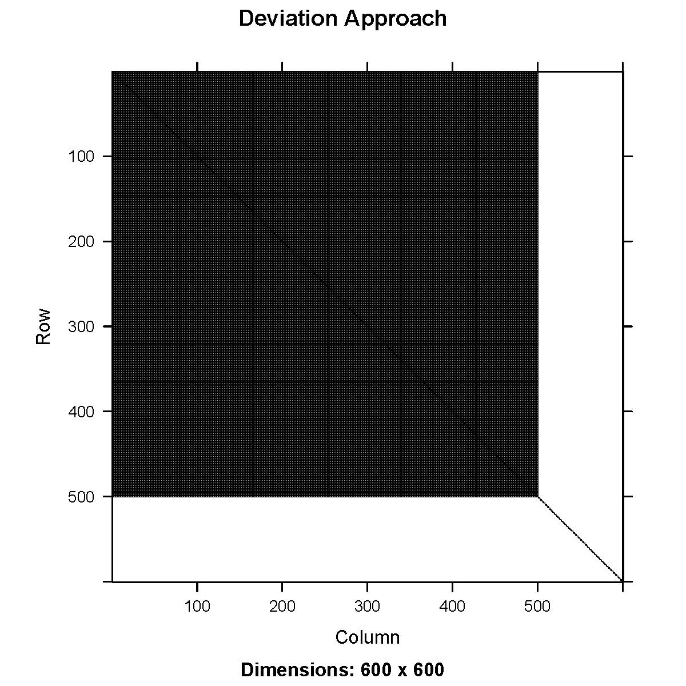
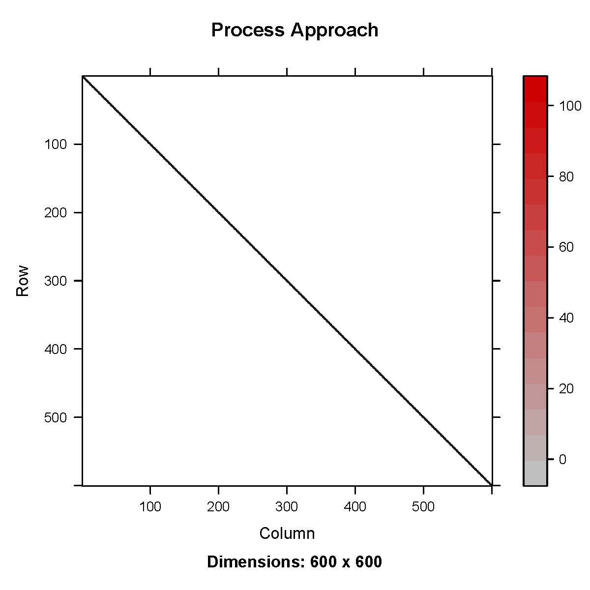
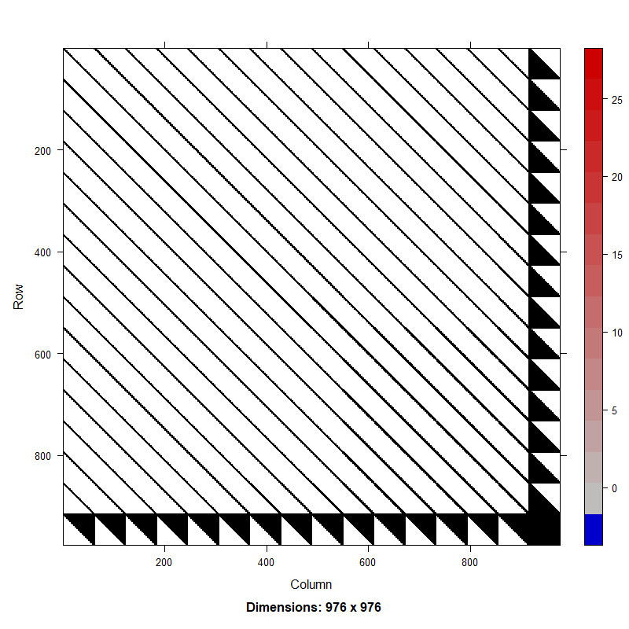
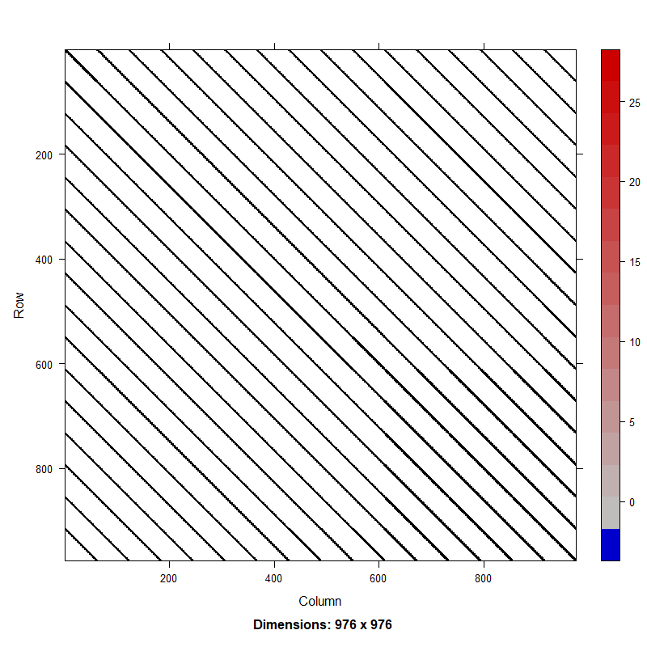

```{r setup, include=FALSE}
knitr::opts_chunk$set(echo = TRUE)
```

## Introduction

Many stock assessment models in the US have historically used an annual 
deviations approach when estimating time varying process variability in 
model parameters such as recruitment. In this approach a mean parameter value 
$\tilde{P}$ and annual devation values $Pdev_{y}$ are estimated and combined 
to produce annual parameter estimates $P_{y}$ with deviations often being 
additive or multiplicative of the mean. Models utilizing this approach have 
predominantly implemented deviations as fixed effects with a positive definite 
hessian commonly ensured though a penalized likelihood such as imposing a sum 
to zero constraint. A fixed effect vector of deviation parameters does not 
require second order partial derivatives to be estimated until model 
optimization is complete and variance is estimated. 

Following statistical best practices, FIMS incorporates the use of random 
effects to model process variability in time-varying parameters. Random effect
uncertainty is itegrated out during parameter optimization in TMB using the 
laplace approximation. This integration requires the calculation of second order 
partial derivatives and hessian inversion at each optimization step. While 
simple to interpret and implement, the deviations approach results in a dense 
convariance matrix of correlations between the mean and each annual devation 
estimate. Due to this difference, using the deviations approach in a random
effects model has much larger computational penalty than when only fixed effects were considered in historic modeling platforms.

To quantify the magnitude of this penalty we investigate the performance and
optimization time of a simple random effects model under equivalent sparse vs
dense parameterizations. For this example we utilize two simple proxy models;
an auto regressive AR1 function, and a simple stock assessment model based on babySAM. These proxies should reflect the relative performance gains expected in the real-world correlated time varying processes modeled in stock assessments such as recruitment. Each of these time-series models can be parameterized as a dense matrix, representing the traditional parameter deviations as random effects approach, or as a sparse matrix, as would be achieved by directly estimating annual parameter values as random effects.

These two approaches are anticipated to produce mathematically equivalent 
results while differing in their computational overhead. Confirming this
equivalency and quantifying the runtime improvement will provide support for 
the change in approach relative to previous assessment models.


## Methods

### Time Series Model 

We evaluated a simple time series model where the latent state, $\lambda_{t}$,
at time $t$ follows an AR1 process defined as: 
$\lambda_{t} = \phi * \lambda_{t-1} + \epsilon_{t}$, using two parameterizations:

1. process approach: $\lambda_{t} \sim N(\phi * \lambda_{t-1}, \sigma^{2}_{\lambda})$
2. deviations approach: $\lambda_{t} = \phi * \lambda_{t-1} + \sigma * z_{t}, z_{t} \sim N(0,1)$

-   $\phi$ is the autoregressive coefficient, transformed as: 
    $$
    \phi=2*\text{plogis}(\text{phiTrans})-1
    $$ 
    which ensures $\phi$ remains in the range (-1,1).

-   $\sigma$ is the process standard deviation.

-   The stationary variance of the process is:
    $$
    \text{Var}(\gamma)=\frac{\sigma^2}{(1-\phi^2)}
    $$

Under a random effects model, the process approach puts the random effect on $\lambda_{t}$, while in
the deviations approach, the random effect is applied to $z_{t}$. The joint negative
log-likelihood for this process is computed in state space form where the process
of the current time step is dependent on the previous one and observations, $y$
are *iid* normal:
```{r, eval = FALSE}
 # deviations approach
  nll <- nll -dnorm(z[1],0,sqrt(sd*sd/(1-phi*phi)),log=TRUE)
  nll <- nll -sum(dnorm(z[-1],0,sd,log=TRUE))
  lamda <- numeric(length(z))
  lamda[1] <- 0+z[1]
  for(i in 2:timeSteps){
    lamda[i] <- phi*lamda[i-1]+z[i]
  }
  nll <- nll - sum(dnorm(y, lamda, sdo, TRUE))
  

  # process approach
  nll <- nll -dnorm(lambda[1],0,sqrt(sd*sd/(1-phi*phi)),log=TRUE)
  for(i in 2:timeSteps){
    nll <- nll -dnorm(lambda[i],phi*lambda[i-1],sd,log=TRUE)
  }
  nll <- nll - sum(dnorm(y, lambda, sdo, TRUE))

```

Under this formulation, the process approach results in a sparse precision matrix, 
or the Hessian which is the inverse of the covariance matrix, while the deviations 
approach results in a dense precision matrix (Fig 1). Models are evaluated with 
RTMB (Kristensen, 2019) using the TMB package (Kristensen et al., 2016) in R (R Core Team, 2024).
TMB relies on the Laplace approximation to intergrate out random effects during an inner 
optimization step, afterwhich, the joint negative log-likelihood is minimized with respect to
the fixed effects. The Laplace approximation requires up to the second order partial 
derivatives of the joint negative log-likelihood with respect to the random effects 
to be evaluated at each inner optimization step. The computation cost of the Lapace 
approximation is primarily determined by the cost of inverting the hessian, which is $O(N^3)$ 
for N-dimensional parameter space. As the number of random effects increases, 
the computational cost of inverting the dense hessian from the deviations approach
increases rapidly, while the cost of inverting the sparse hessian from the process
approach increases much more slowly.

 
**Figure 1.** Hessian matrix for AR1 process using deviations approach (top)
and process approach (bottom).

### Catch-at-age Model 

We compared the deviation and process approaches in a simple catch-at-age stock assessment
model by modifying the software package, babySAM. The babySAM model structures recruitment,
numbers at age, and fishing mortality as AR1 processes. We modified the model to 
structure recruitment under both the deviation and process approaches. The main structure 
for recruitment for years 2 and greater was applied to the numbers at age parameter, $N_{y, a=1}$ 
for year $y$ and for age 1 with mean recruitment $\hat{r}$, written as the following:

<!--  TODO: fix deviations approach equation -->
1. deviations approach: $log(N_{y,1}) = \hat{r} + z_{y}, \quad where \quad z_{y} \sim N(z_{y-1},\sigma^{2}_{r})$
2. process approach: $N_{pred} = log(N_{y-1, 1}), \quad where \quad log(N_{y, 1}) \sim N(\hat{r} + \phi*(N_{pred} - \hat{r}))$

The joint negative log-likelihood for recruitment under each approach was computed using
state space form as:

```{r, eval = FALSE}
  # deviations approach
  # AR1 for standard normal innovations at initial condition
  jnll <- jnll - dnorm(z[1], 0, sqrt(sdR*sdR/(1-phi*phi)), log=TRUE)
  # AR1 standard normal innovations for remaining years
  jnll <- jnll - sum(dnorm(z[-1], 0, sdR, log=TRUE))
  # transform innovations (z) to get recruitment deviations
  rec_dev <- numeric(nrow)
  rec_dev[1] <- z[1]  # initial condition
  for(i in 2:nrow){
    rec_dev[i] <- phi * rec_dev[i-1] + z[i]
  }
  # 3. Set recruitment as random walk + transformed deviations
  for(y in 1:nrow){
    # Random walk with optional intercept
    logN[y,1] <- rec_intercept + rec_dev[y]
  }

  # process approach
  # AR1 init conditions
  jnll <- jnll - dnorm(logN[1,1], rec_intercept, sdR/sqrt(1-phi^2), log=TRUE)
  # AR1 for remaining years
  for(y in 2:nrow){
     predN <- logN[y-1,1]
  }
  jnll <- jnll - dnorm(logN[y,1], rec_intercept + phi*(predN - rec_intercept), sdR, TRUE)
```

Catch-at-age models compared recruitment with and without the recruitment intercept
term to compare model parameterizations common in Europe (without intercept) and
the US (with intercept) to ensure the intercept did not influence the sparsity of the 
Hessian. 

We ran a speed test by repeating model runs on the catch-at-age model 25 times, each time modifying the observation variance parameter using random noise from a normal distribution with 
standard deviation of 0.03. We compared computational times from the speed test and compared parameter estimates, including recruitment from the first model run.. 

## Results

This analysis looked at both a simple AR1 time series and a simple catch-at-age stock assessment model with an AR1 process in recruitment. Both analyses demonstrate that model results are the same despite the parameterization used. 

The process approach resulted in a sparse Hessian while the deviations approach resulted in a Hessian that was dense in recruitment (Fig. 2). Results from the speed test indicated the process approach was approximately 2x times faster than the deviations approach both with and without an estimated intercept (Table 1). While speed up for a single AR1 process is minimal, more complex stock assessments currently include AR1 random effects in multiple processes (e.g. numbers at age, maturity, mortality, etc.). The computational cost of fitting the centered approach scales significantly, warranting the need to adopt the more computationally efficient non-centered parameterization when estimating AR1 processes as random effects.

Table 1. Results from speed test (in seconds) from running models 25 times. Results are from a Windows operating system with 1.80 GHz Processor and 16 GB RAM. Note that absolute results are machine dependent but relative results will be consistent across systems.

|           |Without Intercept|With Intercept |
|-----------|-----------------|---------------|
|process    |155.3            |162.88         |
|deviations |334.77           |327.45         |
 

 
**Figure 1.** Hessian matrix for random effects model with an AR1 process on recruitment in a catch-at-age model using deviations approach (top) and process approach (bottom).