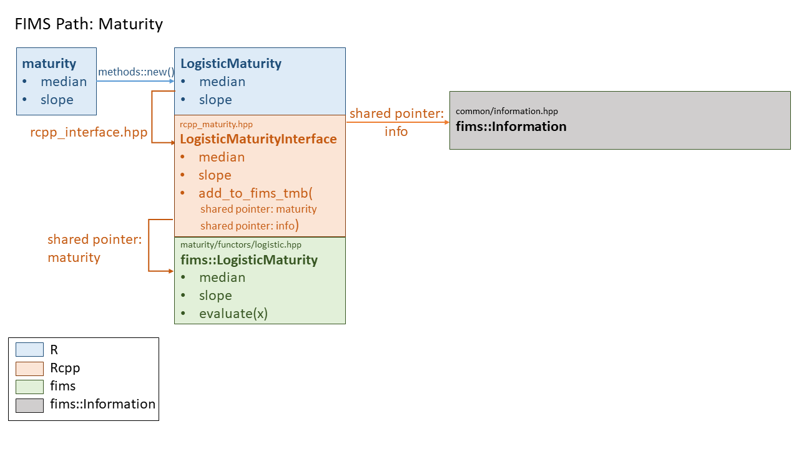
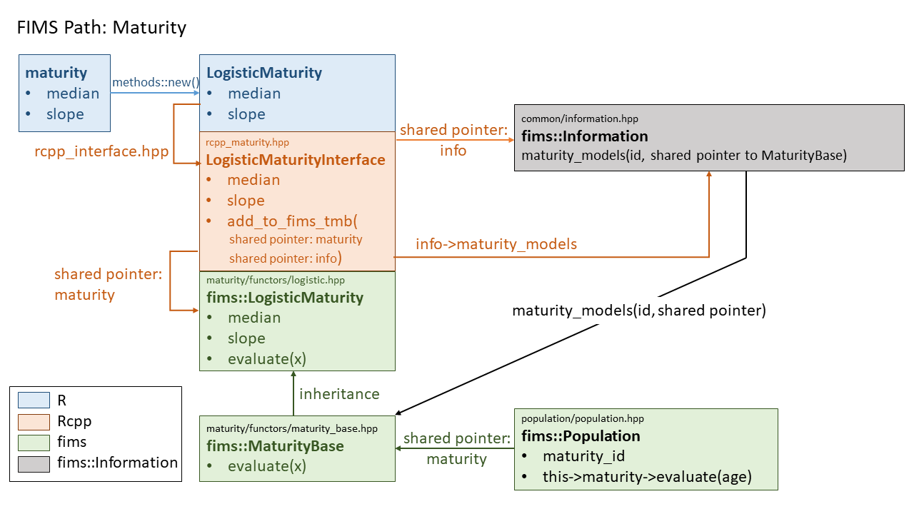

```{r, include = FALSE}
knitr::opts_chunk$set(
  collapse = TRUE,
  comment = "#>"
)
```


```{css, echo=FALSE}

.rchunk {
  border: solid #2e75b6;
}
.rcppchunk {
  border: solid #c55a11;
}
.fimschunk {
  border: solid #548235;
}
.infochunk {
  border: solid #262626;
}
```


<style type="text/css">
code span.co{
  color: #8c8c8c; 
}
</style>

This vignette describes the hierarchical structure of FIMS by describing the linkages, or *path* through the FIMS model using maturity as an example. The vignette is tailored to FIMS developers or others interested in understanding the FIMS core architecture. The vignette walks through how user provided input from R is carried into the core FIMS calculations. 

The vignette will build up components to the final path:
```{r image-path-maturity-8a, echo = FALSE, message=FALSE, out.width = '100%'}
knitr::include_graphics("figures/fims-path-maturity-8.png")
```

Code chunks in this vignette will be color coded similar to this diagram: R code in blue, Rcpp interface code in orange, fims core code in green, and information in grey.

## Setting up a module in R

We'll start from R. The first step is to retrieve the FIMS module, create a new maturity module inside FIMS, and populate the maturity module with parameter values. 

```{r, class.source = "rchunk", eval = FALSE}
# load FIMS
library(FIMS)
# Create a new maturity model
maturity <- new(LogisticMaturity)
# Populate the maturity module with parameter values.
maturity$inflection_point[1]$value <- 10
maturity$inflection_point[1]$is_random_effect <- FALSE
maturity$inflection_point[1]$estimated <- FALSE
maturity$slope[1]$value <- 0.2
maturity$slope[1]$is_random_effect <- FALSE
maturity$slope[1]$estimated <- FALSE
```

After that, we need to create and set up a population and link the maturity module to the population:
```{r,  class.source = "rchunk", eval = FALSE}
population <- new(Population)
# set up population specific parameters (other modules)
# ...
# set maturity for the population - will throw error until PR #363 is merged into main
population$SetMaturity(maturity$get_id())
```

Because FIMS sets up objects stored in memory, simply running `rm(Fims)`, won't free this memory back up. There is a function that can be run to clear out memory:
```{r,  class.source = "rchunk", eval = FALSE}
# Clear C++ memory
clear()
# Clear R memory
rm(Fims)
rm(maturity)
rm(population)
```
Also restarting or closing out your R session will free up memory.

## The Rcpp Interface

The fields specific to the maturity module that are accessible from R are defined in the 
[rcpp_interface.hpp](https://github.com/NOAA-FIMS/FIMS/blob/main/inst/include/interface/rcpp/rcpp_interface.hpp) file in the directory [inst/include/interface/rcpp](https://github.com/NOAA-FIMS/FIMS/tree/main/inst/include/interface/rcpp):

```{Rcpp, class.source = "rcppchunk", eval = FALSE}
Rcpp::class_<LogisticMaturityInterface>("LogisticMaturity")
      .constructor()
      .field("inflection_point", &LogisticMaturityInterface::inflection_point)
      .field("slope", &LogisticMaturityInterface::slope)
      .method("get_id", &LogisticMaturityInterface::get_id)
      .method("evaluate", &LogisticMaturityInterface::evaluate);
```

The code above shows that there are two maturity module-specific fields (i.e., parameters), `inflection_point` and `slope`, and two maturity module-specific methods (i.e., functions), `get_id` and `evaluate`. Defined methods are functions that can be called from R. You can access the fields and methods from R using the `show(Fims)` function. 

The maturity module's `get_id` method returns a unique ID for this specific module.

When creating a new module in R, users can access the module using the name in quotes from the `Rcpp::class`, `LogisticMaturity`

```{r, class.source = "rchunk", eval = FALSE}
maturity <- new(LogisticMaturity)
```

This module references the maturity rcpp class, `LogisticMaturityInterface` defined in [rcpp_maturity.hpp](https://github.com/NOAA-FIMS/FIMS/blob/main/inst/include/interface/rcpp/rcpp_objects/rcpp_maturity.hpp) in the directory [inst/include/interface/rcpp/rcpp_objects](https://github.com/NOAA-FIMS/FIMS/tree/main/inst/include/interface/rcpp/rcpp_objects).

The rcpp_maturity.hpp file consists of a `MaturityInterfaceBase` class and a `LogisticMaturityInterface` class, with the former being the **parent class** and the latter being the **child class**:

```{Rcpp, class.source = "rcppchunk", eval = FALSE}
class MaturityInterfaceBase : public FIMSRcppInterfaceBase {
 public:
  static uint32_t id_g; /**< static id of the recruitment interface base*/
  uint32_t id;          /**< id of the recruitment interface base */
  ...
}

class LogisticMaturityInterface : public MaturityInterfaceBase {
 public:
  Parameter inflection_point; /**< the index value at which the response reaches .5 */
  Parameter slope;  /**< the width of the curve at the inflection_point */
  ...
}
```

We typically will reference the child class from R to specify the formulation of maturity we wish to use in a specific model run of FIMS. In this particular example, we are using the logistic form of maturity. 

```{r image-path-maturity-1, echo = FALSE, message=FALSE, out.width = '85%'}
knitr::include_graphics("figures/fims-path-maturity-1.png")
```

All Rcpp interface classes from FIMS define parameters (e.g., `inflection_point`, `slope`) using the `Parameter` class defined in [rcpp_interface_base.hpp](https://github.com/NOAA-FIMS/FIMS/blob/main/inst/include/interface/rcpp/rcpp_objects/rcpp_interface_base.hpp) in the directory [inst/include/interface/rcpp/rcpp_objects](https://github.com/NOAA-FIMS/FIMS/blob/main/inst/include/interface/rcpp/rcpp_objects):

```{Rcpp, class.source = "rcppchunk", eval = FALSE}
class Parameter {
 public:
  double value; /**< initial value of the parameter*/
   //std::numeric_limits<double>::min() returns a very large negative number
  double min =
      std::numeric_limits<double>::min(); /**< min value of the parameter*/
  
   //std::numeric_limits<double>::max() returns a very large positive number
  double max =
      std::numeric_limits<double>::max(); /**< max value of the parameter*/
  bool is_random_effect = false;          /**< Is the parameter a random effect
                                             parameter? Default value is false.*/
  bool estimated =
      false; /**< Is the parameter estimated? Default value is false.*/
  ...
  }
```
The fields from the `Parameter` class that are accessible from R are defined in the 
[rcpp_interface.hpp](https://github.com/NOAA-FIMS/FIMS/blob/main/inst/include/interface/rcpp/rcpp_interface.hpp) file in the directory [inst/include/interface/rcpp](https://github.com/NOAA-FIMS/FIMS/tree/main/inst/include/interface/rcpp):

```{Rcpp, class.source = "rcppchunk", eval = FALSE}
 Rcpp::class_<Parameter>("Parameter")
      .constructor()
      .constructor<double>()
      .constructor<Parameter>()
      .field("value", &Parameter::value)
      .field("min", &Parameter::min)
      .field("max", &Parameter::max)
      .field("is_random_effect", &Parameter::is_random_effect)
      .field("estimated", &Parameter::estimated);
```

Each field (i.e., parameter) from `maturity` (i.e., the maturity module we defined in R) will therefore inherit the five fields defined in the Parameter class: `value`, `min`, `max`, `is_random_effect`, `estimated`. 

## Linking the Rcpp interface to the fims namespace.

### What is the `fims` namespace?

A namespace in C++ is similar to what a library is in R.

The core of FIMS is within the `fims` namespace and is a convenient way to differentiate between the part of the C++ code base that is portable, i.e., independent of statistical platform, and the part of the codebase that depends on platforms outside of base C++ (e.g., `{Rcpp}`, R, `{TMB}`). Any code written within:
```{Rcpp,  class.source = "fimschunk", eval = FALSE}
namespace fims{
  
}
```
is considered to be a part of the `fims` namespace. C++ classes written within the `fims` namespace can be accessed within the C++ code base using `fims_popdy::`.

There are some exceptions where `{TMB}` specific code is referenced within the `fims` namespace. In these cases, code is written within an `#ifdef TMB_MODEL` wrapper, which means the code is only defined if `{TMB}` is being used. Given the addition of a new platform, eg. stan, a new wrapper could be added to define platform specific code for these sections. 

For example, the definition of data types in [interface.hpp](https://github.com/NOAA-FIMS/FIMS/blob/main/inst/include/interface/interface.hpp) in the directory [inst/include/interface](https://github.com/NOAA-FIMS/FIMS/tree/main/inst/include/interface) will always be platform dependent as each platform has specific requirements for how the data types are defined. Whenever a new platform is added to `{FIMS}`, we will need to set up the platform specific data type definitions:
```{Rcpp,  class.source = "fimschunk", eval = FALSE}
namespace fims {

#ifdef TMB_MODEL
/**
 *  @brief fims::ModelTraits class that contains the DataVector
 * and ParameterVector types.
 */
template <typename Type>
struct fims::ModelTraits {
  typedef typename CppAD::vector<Type> DataVector;      /**< This is a vector
        of the data that is differentiable */
  typedef typename CppAD::vector<Type> ParameterVector; /**< This is a
  vector of the parameters that is differentiable */
  typedef typename tmbutils::vector<Type>
      EigenVector; /**< This is a vector as defined in TMB's namespace Eigen */
};
#endif /* TMB_MODEL */
}  // namespace fims

//not developed yet
#ifdef STAN_MODEL
//stan specific definitions go here
#endif
```

### Getting back to the maturity example...
Each Rcpp interface object includes an `add_to_fims_tmb()` function. There are two shared pointers set up within this function, one to link each Rcpp interface object (e.g., LogisticMaturityInterface) to the `Information` class in the `fims` namespace defined in [information.hpp](https://github.com/NOAA-FIMS/FIMS/blob/main/inst/include/common/information.hpp) in the directory [inst/include/common](https://github.com/NOAA-FIMS/FIMS/tree/main/inst/include/common) and one to link to the matching class in the `fims` namespace. In our maturity example, this would be the `LogisticMaturity` class in the `fims` namespace defined in [logistic.hpp](https://github.com/NOAA-FIMS/FIMS/blob/main/inst/include/population_dynamics/maturity/functors/logistic.hpp) in the directory [inst/include/population_dynamics/maturity/functors](https://github.com/NOAA-FIMS/FIMS/tree/main/inst/include/population_dynamics/maturity/functors).


Within the rcpp_maturity.hpp file, we can link to the `fims_info::Information` class in order to register maturity parameters and specify whether or not they are random effects. We do this by setting up two pointers in the interface: d0 which points to information, and lm0, which points to the logistic maturity module. 

```{Rcpp, class.source = "rcppchunk", eval = FALSE}
//file: rcpp_maturity.hpp

//d0 is a shared pointer that points to fims_info::Information
std::shared_ptr<fims_info::Information<TMB_FIMS_REAL_TYPE> > d0 =
        fims_info::Information<TMB_FIMS_REAL_TYPE>::GetInstance();
 if (this->inflection_point.estimated) {
      if (this->inflection_point.is_random_effect) {
        /*
         if inflection_point is estimated and a random effect, 
         the inflection_point value from LogisticMaturityInterface (lm0->inflection_point) 
         is passed to the Information member function RegisterRandomEffect
        */
        d0->RegisterRandomEffect(lm0->inflection_point);
      } else {
        /*
         if inflection_point is estimated and not a random effect, 
         the inflection_point value from LogisticMaturityInterface (lm0->inflection_point)
         is passed to the Information member function RegisterParameter
         */
        d0->RegisterParameter(lm0->inflection_point);
      }
    }
```


Linking to the `fims_popdy::LogisticMaturity` class allows us to link the values input from R with the values used in model calculation:
```{Rcpp, class.source = "rcppchunk", eval = FALSE}
//file: rcpp_maturity.hpp

//lm0 is a shared pointer that points to fims_popdy::LogisticMaturity
std::shared_ptr<fims_popdy::LogisticMaturity<TMB_FIMS_REAL_TYPE> > lm0 =
        std::make_shared<fims_popdy::LogisticMaturity<TMB_FIMS_REAL_TYPE> >();
 
/*
 the inflection_point value from LogisticMaturity (lm0->inflection_point)
 equals the inflection_point value from LogisticMaturityInterface (this->inflection_point.value)
 */
lm0->inflection_point = this->inflection_point.value;
```

We can also link these two pointers together so that the **fims_info::Information** class links up with the **fims_popdy::LogisticMaturity**, but more details on this later.
```{Rcpp, class.source = "rcppchunk", eval = FALSE}
//file: rcpp_maturity.hpp

/*
 the maturity_models pointer from Information that matches the 
 id of the fims_popdy::LogisticMaturity class is equal to the pointer 
 to fims_popdy::LogisticMaturity 
 */
d0->maturity_models[lm0->id] = lm0;
```


The $\color{#c55a11}{\text{`add_to_fims_tmb()`}}$ function repeats code four times to track the estimated value of parameters along with their first, second, and third derivatives. 


```{r image-path-maturity-2, echo = FALSE, message=FALSE, out.width = '100%'}
knitr::include_graphics("figures/fims-path-maturity-2.png")
```


## Inside the `fims_popdy::LogisticMaturity` class

The `LogisticMaturity` class in the `fims` namespace defined in [logistic.hpp](https://github.com/NOAA-FIMS/FIMS/blob/main/inst/include/population_dynamics/maturity/functors/logistic.hpp) in the directory [inst/include/population_dynamics/maturity/functors](https://github.com/NOAA-FIMS/FIMS/tree/main/inst/include/population_dynamics/maturity/functors) has an `evaluate` method (i.e., function) that takes an input, *x* and returns the output from a logistic function (defined in [fims_math.hpp](https://github.com/NOAA-FIMS/FIMS/blob/main/inst/include/common/fims_math.hpp) in the directory [inst/include/common](https://github.com/NOAA-FIMS/FIMS/blob/main/inst/include/common)) using the class member `inflection_point` and `slope` values.  

```{Rcpp,  class.source = "fimschunk", eval = FALSE}
namespace fims_popdy {

/**
 *  @brief LogisticMaturity class that returns the logistic function value
 * from fims_math.
 */
template <typename Type>
struct LogisticMaturity : public MaturityBase<Type> {
  Type inflection_point; /**< 50% quantile of the value of the quantity of interest (x); e.g.,
               age at which 50% of the fish are mature */
  Type slope;  /**<scalar multiplier of difference between quantity of interest
               value (x) and inflection_point */

  LogisticMaturity() : MaturityBase<Type>() {}

  /**
   * @brief Method of the logistic maturity class that implements the
   * logistic function from FIMS math.
   *
   * @param x  The independent variable in the logistic function (e.g., age or
   * size at maturity).
   */
  virtual const Type evaluate(const Type& x) {
    return fims_math::logistic<Type>(inflection_point, slope, x);
  }
};

}  // namespace fims
```

```{r image-path-maturity-3, echo = FALSE, message=FALSE, out.width = '100%'}

```

## Calling maturity from population

The `Population` class defined in [population.hpp](https://github.com/NOAA-FIMS/FIMS/blob/main/inst/include/population_dynamics/population/population.hpp) in the directory [inst/include/population_dynamics/population](https://github.com/NOAA-FIMS/FIMS/blob/main/inst/include/population_dynamics/population) is where all the biological calculations happen, producing expected values used in likelihood equations and derived values important for management (e.g., spawning biomass). 

To evaluate maturity within the `Population` class, we first need to set up a shared pointer, linking the maturity module to population.

```{Rcpp,  class.source = "fimschunk", eval = FALSE}
//file: inst/include/population_dynamics/population/population.hpp
// maturity is a shared pointer to MaturityBase
int maturity_id = -999; /**< id of maturity model object*/
std::shared_ptr<fims_popdy::MaturityBase<Type>>
      maturity; /**< shared pointer to maturity module */
```

The `maturity_id` was set from R using the `SetMaturity()` method from the `PopulationInterface` class:
```{r,  class.source = "rchunk", eval = FALSE}
population$SetMaturity(maturity$get_id())
```

Notice above that population by default declares a pointer of type `MaturityBase` (parent class), not the specific maturity class we are using in this example, `LogisticMaturity` (child class). `MaturityBase` has an `evaluate` method with input arguments that match the inputs of each child class:

```{Rcpp,  class.source = "fimschunk", eval = FALSE}
//file: inst/include/population_dynamics/maturity/functors/maturity_base.hpp
namespace fims_popdy {

/** @brief Base class for all maturity functors.
 *
 * @tparam TypeThe type of the maturity functor.
 */

template <typename Type>
struct MaturityBase : public fims_model_object::FIMSObject<Type> {
  // id_g is the ID of the instance of the MaturityBase class.
  // this is like a memory tracker.
  // Assigning each one its own ID is a way to keep track of
  // all the instances of the MaturityBase class.
  static uint32_t id_g; /**< The ID of the instance of the MaturityBase class */

  /** @brief Constructor.
   */
  MaturityBase() {
    // increment id of the singleton maturity class
    this->id = MaturityBase::id_g++;
  }

  /**
   * @brief Calculates the maturity.
   * @param x The independent variable in the maturity function (e.g., logistic
   * maturity at age or size).
   */
  virtual const Type evaluate(const Type& x) = 0;
};
```

The evaluate function is a [virtual C++ function](https://www.geeksforgeeks.org/virtual-function-cpp/), which means the function can be overwritten by functions of the same name from a child class. This structure keeps the maturity module in population generic. We don't need any conditional statements to loop over all possible maturity formulations within population. We only need to add a new child maturity class with an Rcpp interface and we can automatically call it from population. There is a trade-off here. We are creating a nested hierarchical structure that makes the code base harder to read. In exchange, we're creating code with a lower [cyclomatic complexity](https://en.wikipedia.org/wiki/Cyclomatic_complexity), that is there will only ever be one independent path from the user to the maturity->evaluate() call in population, regardless of how many maturity functions are added to FIMS. Code with lower cyclomatic complexity is easier to test, maintain, and extend.  

Once we've set up the shared pointer, we can access maturity from within population:
```{Rcpp,  class.source = "fimschunk", eval = FALSE}
//file: inst/include/population_dynamics/population/population.hpp
 /**
   * @brief Calculates expected proportion of individuals mature at a selected
   * age
   *
   * @param i_age_year dimension folded index for age and year
   * @param age the age of maturity
   */
  void CalculateMaturityAA(size_t i_age_year, size_t age) {
    // this->maturity is pointing to the maturity module, which has
    //  an evaluate function. -> can be nested.
    this->proportion_mature_at_age[i_age_year] =
        this->maturity->evaluate(ages[age]);
  }

```

```{r image-path-maturity-4, echo = FALSE, message=FALSE, out.width = '100%'}
knitr::include_graphics("figures/fims-path-maturity-4.png")
```

## Linking everything together

The above material demonstrates how values passed in from R get propagated into population.hpp, where they are used in biologically relevant calculations. This, however, relies on population referencing the correct child class (eg. `LogisticMaturity`) even though it only calls the parent class (`MaturityBase`). We defined the `maturity_id` in population for the specific logistic maturity module we wanted to use, `population$SetMaturity(maturity$get_id())`, but we still need to connect this ID with the actual module in memory. 

This *information* is managed in FIMS through the `Information` class in [information.hpp](https://github.com/NOAA-FIMS/FIMS/blob/main/inst/include/common/information.hpp) in the directory [inst/include/common](https://github.com/NOAA-FIMS/FIMS/tree/main/inst/include/common). The Information class sets up a number of [C++ maps](https://cplusplus.com/reference/map/map/) (a container with a key value and mapped value - think of named lists in R) where the key is the unique ID to the module and the mapped value is a shared pointer to the module. C++ std::maps have an iterator member for stepping through the elements of the map. This iterator is also declared in the Information class so that we can loop through all the unique maturity modules being called in FIMS. We currently only have one, but if FIMS gets extended to include multiple populations, we could have a unique maturity module for each population or subset of populations.  

```{Rcpp,  class.source = "infochunk", eval = FALSE}
//file: inst/include/common/information.hpp
/*
 uint32_t is an unsigned integer (always positive)
 The first component of the map is a uint32_t which 
 will be used to hold the ID.
 The second component of the map is the shared pointer, 
 maturity_models, that points to fims_popdy::MaturityBase
 */
std::map<uint32_t, std::shared_ptr<fims_popdy::MaturityBase<Type> > >
      maturity_models; /**<hash map to link each object to its shared location
                          in memory*/

//Next we set up the iterator, which will be used to loop 
//over all defined maturity modules
typedef typename std::map<uint32_t, 
                          std::shared_ptr<fims_popdy::MaturityBase<Type> > >::iterator
      maturity_models_iterator;
```

```{r image-path-maturity-5, echo = FALSE, message=FALSE, out.width = '100%'}

```

Next, let's revisit the line of code that was written in the Rcpp `LogisticMaturityInterface` class in [rcpp_maturity.hpp](https://github.com/NOAA-FIMS/FIMS/blob/main/inst/include/interface/rcpp/rcpp_objects/rcpp_maturity.hpp) in the directory [inst/include/interface/rcpp/rcpp_objects](https://github.com/NOAA-FIMS/FIMS/tree/main/inst/include/interface/rcpp/rcpp_objects)

Here, we are setting the maturity_models pointer in `Information` to equal the `lm0` pointer to the `LogisticMaturity` module
```{Rcpp,  class.source = "rcppchunk", eval = FALSE}
//file: rcpp_maturity.hpp

/*
 the maturity_models pointer from Information that matches the id of the 
 fims_popdy::LogisticMaturity class is equal to the pointer to fims_popdy::LogisticMaturity 
 */
d0->maturity_models[lm0->id] = lm0;
```

```{r image-path-maturity-6, echo = FALSE, message=FALSE, out.width = '100%'}
knitr::include_graphics("figures/fims-path-maturity-6.png")
```

Now we need to pass this pointer to the maturity pointer in population so that `population->maturity` points to the `LogisticMaturity` module instead of `MaturityBase`. First we set up a map in `Information` that points to `Population`. 
```{Rcpp,  class.source = "infochunk", eval = FALSE}
//file: inst/include/common/information.hpp
std::map<uint32_t, std::shared_ptr<fims_popdy::Population<Type> > >
      populations; /**<hash map to link each object to its shared location in
                      memory*/
  typedef typename std::map<uint32_t,
                            std::shared_ptr<fims_popdy::Population<Type> > >::iterator
      population_iterator;
  /**< iterator for population objects>*/
```

```{r image-path-maturity-7, echo = FALSE, message=FALSE, out.width = '100%'}
knitr::include_graphics("figures/fims-path-maturity-7.png")
```

We then loop through the populations and create a new shared pointer, `p`, to reference the individual population of interest.  

```{Rcpp,  class.source = "infochunk", eval = FALSE}
//file: inst/include/common/information.hpp
 for (population_iterator it = this->populations.begin();
             it != this->populations.end(); ++it) {
          std::shared_ptr<fims_popdy::Population<Type> > p = (*it).second;
          ...
```
In this code chunk, `(*it)` refers to a single population in the `populations` map. The second element of the map is the pointer, so `p = (*it).second` means we are setting the pointer to a single population to equal the pointer to `populations` in the map. 

Within this population loop, we then link the `maturity` pointer in `population` to equal the `maturity` pointer in information, passing on the information that we want to use the `LogisticMaturity` class:

```{Rcpp,  class.source = "infochunk", eval = FALSE}  
//file: inst/include/common/information.hpp
  // set maturity
  if (p->maturity_id != -999) {
    uint32_t maturity_uint = static_cast<uint32_t>(p->maturity_id);
    maturity_models_iterator it = this->maturity_models.find(
        maturity_uint);  // >maturity_models is specified in
                         // information.hpp and used in rcpp

    if (it != this->maturity_models.end()) {
      //p->maturity is the maturity pointer in population
      p->maturity =
          //(*it).second is the maturity pointer in information
          (*it).second;  // >maturity defined in population.hpp
    }
```

Here, (\*it) is referring to the `maturity_models` map in information and (\*it).second refers to the second element of the map, which is the pointer to the maturity module.

```{r image-path-maturity-8, echo = FALSE, message=FALSE, out.width = '100%'}
knitr::include_graphics("figures/fims-path-maturity-8.png")
```


## Conceptualizing this path with R
This is an optional exercise for those who benefit from thinking through the structure in C++ code by seeing its corollary in R. 

Let's think about writing something similar in R using lists for three populations and two maturity functions. Each R code section corresponds with C++ code taken from FIMS. These FIMS sections will be commented out to help distinguish between the two code sets. The idea is to link what is happening in FIMS to a language we're all a bit more familiar with.

Example Case:
Let's set up 3 populations where the first two have a mirrored logistic maturity function and the third has a different maturity function. This third function could be a different function all together or a logistic function with a different parameter set. For this example, we'll use a logistic function with a different parameter set.

```{r}
# For the population module, there are additional parameters
# we are going to ignore here
population_modules <- list(
  "Pop 1" = list(
    id = 1,
    maturity = "MaturityBase"
  ),
  "Pop 2" = list(
    id = 2,
    maturity = "MaturityBase"
  ),
  "Pop 3" = list(
    id = 3,
    maturity = "MaturityBase"
  )
)
maturity_modules <- list(
  "Logistic Maturity" = list(id = 1, inflection_point = 10, slope = 0.2),
  "Some Other Maturity" = list(id = 2, inflection_point = 8, slope = 0.3)
)
```

We can think of population_modules and maturity_modules above as instantiated C++ classes stored in our computer's memory. This R code chunk above is comparable to the following from FIMS, which sets up modules in R:

```{r, eval = FALSE}
# maturity1 <- new(LogisticMaturity)
# maturity1$inflection_point$value <- 10
# maturity1$slope$value <- 0.2
# maturity2 <- new(LogisticMaturity)
# maturity2$inflection_point$value <- 8
# maturity2$slope$value <- 0.3
# population1 <- new(Population)
# population2 <- new(Population)
# population3 <- new(Population)
```

Next we assign which maturity will be used with each population using IDs
```{r}
population_modules[[1]]$maturity_id <- maturity_modules[[1]]$id
population_modules[[2]]$maturity_id <- maturity_modules[[1]]$id
population_modules[[3]]$maturity_id <- maturity_modules[[2]]$id
```

This R code chunk above is comparable to the following from FIMS, which sets IDs in R:
```{r, eval = FALSE}
# population1$SetMaturity(maturity1$get_id())
# population2$SetMaturity(maturity1$get_id())
# population3$SetMaturity(maturity2$get_id())
```

Now let's review what is happening in Information. We'll start by setting up an empty list in R. 
```{r}
information <- list(
  populations = list(id = NULL, pointer = "Population"),
  maturity = list(id = NULL, pointer = "MaturityBase")
)
```
In FIMS, the Information class has the objects, population and maturity, which are C++ maps. The first element of the map is the ID, the second element of the map is the pointer to the Population or Maturity class:

```{r, eval = FALSE} 
# std::map<uint32_t, std::shared_ptr<fims_popdy::MaturityBase<Type> > > maturity_models;
# std::map<uint32_t, std::shared_ptr<fims_popdy::Population<Type> > > populations;
```
  
We can then link up the pointers in information to each respective module:

```{r}          
information$populations[[1]] <- list(id = 1, pointer = population_modules[[1]])
information$populations[[2]] <- list(id = 2, pointer = population_modules[[2]])
information$populations[[3]] <- list(id = 3, pointer = population_modules[[3]])

information$maturity[[1]] <- list(id = 1, pointer = maturity_modules[[1]])
information$maturity[[2]] <- list(id = 2, pointer = maturity_modules[[2]])
```

In FIMS, these definitions happen by passing information from the rcpp interface into FIMS Information. 
```{r,  class.source = "rcppchunk", eval = FALSE}
## //file: rcpp_maturity.hpp
## d0 is the pointer to information
## lm0 is the pointer to a specific maturity module
## (e.g., lm0 = maturity_modules[[1]])
# d0->maturity_models[lm0->id] = lm0;
```

We can then loop through each population module defined in information and set the maturity we're getting from the user specified in the Rcpp interface back out to the Population class used to run all the calculations in the model. After each line of code in the following chunk, corresponding C++ code from FIMS is directly below and commented out.

```{r}
for (it in 1:length(population_modules)) {
  # for (population_iterator it = this->populations.begin();
  #            it != this->populations.end(); ++it) {

  p <- information$populations[[it]][2]
  # std::shared_ptr<fims_popdy::Population<Type> > p = (*it).second;

  maturity_uint <- p$pointer$maturity_id
  # uint32_t maturity_uint = static_cast<uint32_t>(p->maturity_id);

  newit <- which(sapply(information$maturity, function(x) x$id) == maturity_uint)
  # maturity_models_iterator it = this->maturity_models.find(maturity_uint)

  p$pointer$maturity # MaturityBase
  p$pointer$maturity <- information$maturity[[newit]][[2]]
  p$pointer$maturity # LogisticMaturity1
  # p->maturity = (*it).second;

  population_modules[[it]][2]$maturity <- p$pointer$maturity
}

sapply(population_modules, function(x) x[2]$maturity)
```

In R, the above code sets up an intermediate value, p. Once we update the maturity from p to equal the correct maturity module, `p$pointer$maturity <- information$maturity[[newit]][[2]]`, the above code passes this back to population_modules, `population_modules[[it]][2]$maturity <- p$pointer$maturity`. In this context, `population_modules` is the population class held in memory that is being used to run calculations.

The deeper level of abstraction happening in C++ is that in FIMS, _p is the population module_ stored in memory. An equivalent line of code to `population_modules[[it]][2]$maturity <- p$pointer$maturity` isn't needed in FIMS because when we update p, we are also updating the population class held in memory that is being used to run calculations.


