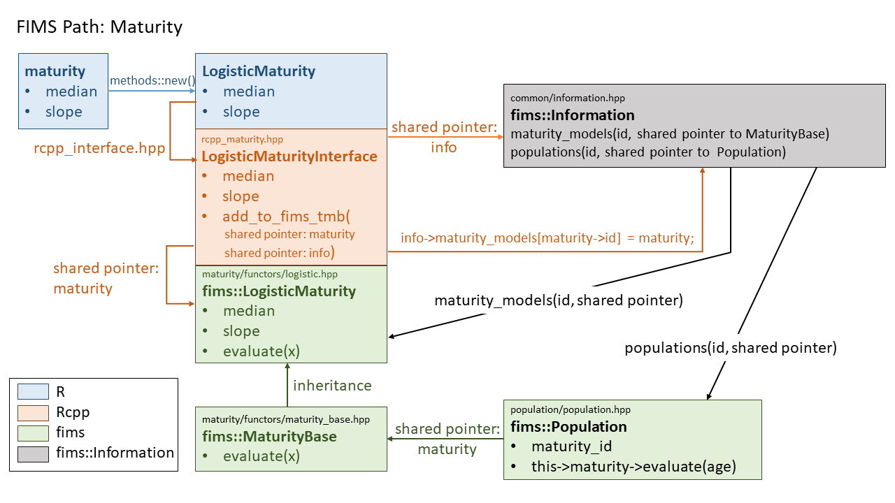

```{r, include = FALSE}
knitr::opts_chunk$set(
  collapse = TRUE,
  comment = "#>"
)
```
This vignette describes the hierarchical structure of FIMS by describing the linkages, or *path* through the FIMS model using maturity as an example. The vignette walks through how input from R is carried into the core FIMS calculations. 

## Setting up a module in R and linking to the Rcpp interface

We'll start from R. The first step is to install FIMS, retrieve the FIMS module, create a new maturity module inside FIMS, and populate the maturity module with parameter values. 

```{r, eval = FALSE}
remotes::install_github("NOAA-FIMS/FIMS")
library(FIMS)
fims <- Rcpp::Module("fims", PACKAGE = "FIMS")
maturity <- new(fims$LogisticMaturity)
maturity$median$value <- 10
maturity$median$is_random_effect <- FALSE
maturity$median$estimated <- FALSE
maturity$slope$value <- 0.2
maturity$slope$is_random_effect <- FALSE
maturity$slope$estimated <- FALSE
```

After that, we need to set up a population and link the maturity module to the population:
```{r, eval = FALSE}
population <- new(fims$Population)
#set up population specific parameters
#...
#set maturity for the population - will throw error until PR #363 is merged into main
population$SetMaturity(maturity$get_id())
```

All modules from FIMS contain member fields corresponding to their parameters that inherit from the Parameter class defined in [rcpp_interface_base.hpp](https://github.com/NOAA-FIMS/FIMS/blob/main/inst/include/interface/rcpp/rcpp_objects/rcpp_interface_base.hpp) under [inst/include/interface/rcpp/rcpp_objects](https://github.com/NOAA-FIMS/FIMS/blob/main/inst/include/interface/rcpp/rcpp_objects)

```{Rcpp, eval = FALSE}
class Parameter {
 public:
  double value; /**< initial value of the parameter*/
  double min =
      std::numeric_limits<double>::min(); /**< min value of the parameter*/
  double max =
      std::numeric_limits<double>::max(); /**< max value of the parameter*/
  bool is_random_effect = false;          /**< Is the parameter a random effect
                                             parameter? Default value is false.*/
  bool estimated =
      false; /**< Is the parameter estimated? Default value is false.*/
  ...
  }
```
The fields from the Parameter class that are accessible from R are defined in the 
[rcpp_interface.hpp](https://github.com/NOAA-FIMS/FIMS/blob/main/inst/include/interface/rcpp/rcpp_interface.hpp) file under [inst/include/interface/rcpp](https://github.com/NOAA-FIMS/FIMS/tree/main/inst/include/interface/rcpp):

```{Rcpp, eval = FALSE}
 Rcpp::class_<Parameter>("Parameter")
      .constructor()
      .constructor<double>()
      .constructor<Parameter>()
      .field("value", &Parameter::value)
      .field("min", &Parameter::min)
      .field("max", &Parameter::max)
      .field("is_random_effect", &Parameter::is_random_effect)
      .field("estimated", &Parameter::estimated);
```

You can access these from R using the `show(fims)` function.

The fields specific to the maturity module that are accessible from R are defined in the 
[rcpp_interface.hpp](https://github.com/NOAA-FIMS/FIMS/blob/main/inst/include/interface/rcpp/rcpp_interface.hpp) file under [inst/include/interface/rcpp](https://github.com/NOAA-FIMS/FIMS/tree/main/inst/include/interface/rcpp):

```{Rcpp, eval = FALSE}
Rcpp::class_<LogisticMaturityInterface>("LogisticMaturity")
      .constructor()
      .field("median", &LogisticMaturityInterface::median)
      .field("slope", &LogisticMaturityInterface::slope)
      .method("get_id", &LogisticMaturityInterface::get_id)
      .method("evaluate", &LogisticMaturityInterface::evaluate);
```

The hereditary structure between the maturity module and the Parameter class means that each field (i.e. parameter) from maturity will inherit the five fields defined in the Parameter class: **value**, **min**, **max**, **is_random_effect**, **estimated**. The maturity module also has a get_id method (i.e. function) that returns a unique ID for this specific module.

The maturity module is called from R using the name in quotes from the Rcpp::class function, **LogisticMaturity** and references the maturity rcpp object, **LogisticMaturityInterface** defined in [rcpp_maturity.hpp](https://github.com/NOAA-FIMS/FIMS/blob/main/inst/include/interface/rcpp/rcpp_objects/rcpp_maturity.hpp) under [inst/include/interface/rcpp/rcpp_objects](https://github.com/NOAA-FIMS/FIMS/tree/main/inst/include/interface/rcpp/rcpp_objects).

```{r image-path-maturity-1, echo = FALSE, message=FALSE, out.width = '85%'}
knitr::include_graphics("figures/fims-path-maturity-1.png")
```

This rcpp_maturity.hpp file consists of a **MaturityInterfaceBase** class and a **LogisticMaturityInterface** class, with the former being the **parent class** and the latter being the **child class**. We typically will reference the child class from R in order to specify the formulation of maturity we wish to use in a specific model run of FIMS. In this particular example, we are using the logistic form of maturity. 


## Linking the Rcpp interface to the fims namespace.

### What is the fims namespace?

A namespace in C++ is similar to what a library is in R.

The core of FIMS is within the fims namespace and is a convenient way to differentiate between the part of the C++ code base that is portable, i.e. independent of statistical platform, and the part of the codebase that depends on platforms outside of base C++ (e.g. Rcpp, R, TMB). Any code written within:
```{Rcpp, eval = FALSE}
namespace fims{
  
}
```
is considered to be a part of the fims namespace. Classes written within the fims namespace can be accessed using `fims::`

There are some exceptions where TMB specific code is referenced within the fims namespace. In these cases, code is written within an #ifdef TMB_MODEL wrapper. Given the addition of a new platform, eg. stan, a new wrapper could be added to define platform specific code for these sections. For example, the definition of data types in [interface.hpp](https://github.com/NOAA-FIMS/FIMS/blob/main/inst/include/interface/interface.hpp) under [inst/include/interface](https://github.com/NOAA-FIMS/FIMS/tree/main/inst/include/interface) will always be platform dependent as each platform has specific requirements for how the data types are defined. Whenever a new platform is added to FIMS, we will need to set up the platform specific data type definitions:
```{Rcpp, eval = FALSE}
namespace fims {

#ifdef TMB_MODEL
/**
 *  @brief ModelTraits class that contains the DataVector
 * and ParameterVector types.
 */
template <typename T>
struct ModelTraits {
  typedef typename CppAD::vector<T> DataVector;      /**< This is a vector
        of the data that is differentiable */
  typedef typename CppAD::vector<T> ParameterVector; /**< This is a
  vector of the parameters that is differentiable */
  typedef typename tmbutils::vector<T>
      EigenVector; /**< This is a vector as defined in TMB's namespace Eigen */
};
#endif /* TMB_MODEL */
}  // namespace fims

//not developed yet
#ifdef STAN_MODEL
//stan specific definitions go here
#endif
```

### Getting back to the maturity example...
Each Rcpp interface object includes an `add_to_fims_tmb()` function. There are two shared pointers set up within this function, one to link each Rcpp interface object (e.g. LogisticMaturityInterface) to the **Information** class in the fims namespace defined in [information.hpp](https://github.com/NOAA-FIMS/FIMS/blob/main/inst/include/common/information.hpp) under [inst/include/common](https://github.com/NOAA-FIMS/FIMS/tree/main/inst/include/common) and one to link to the matching class in the fims namespace. In our maturity example, this would be the **LogisticMaturity** class in the fims namespace defined in [logistic.hpp](https://github.com/NOAA-FIMS/FIMS/blob/main/inst/include/population_dynamics/maturity/functors/logistic.hpp) under [inst/include/population_dynamics/maturity/functors](https://github.com/NOAA-FIMS/FIMS/tree/main/inst/include/population_dynamics/maturity/functors).


Linking to the **fims::Information** class allows us to register maturity parameters and specify whether or not they are random effects:

```{Rcpp, eval = FALSE}
//d0 is a shared pointer that points to fims::Information
std::shared_ptr<fims::Information<TMB_FIMS_REAL_TYPE> > d0 =
        fims::Information<TMB_FIMS_REAL_TYPE>::GetInstance();
 if (this->median.estimated) {
      if (this->median.is_random_effect) {
        /*
         if median is estimated and a random effect, 
         the median value from LogisticMaturityInterface (lm0->median) 
         is passed to the Information member function RegisterRandomEffect
        */
        d0->RegisterRandomEffect(lm0->median);
      } else {
        /*
         if median is estimated and not a random effect, 
         the median value from LogisticMaturityInterface (lm0->median)
         is passed to the Information member function RegisterParameter
        d0->RegisterParameter(lm0->median);
      }
    }
```


Linking to the **fims::LogisticMaturity** class allows us to link the values input from R with the values used in model calculation:
```{Rcpp, eval = FALSE}
//lm0 is a shared pointer that points to fims::LogisticMaturity
std::shared_ptr<fims::LogisticMaturity<TMB_FIMS_REAL_TYPE> > lm0 =
        std::make_shared<fims::LogisticMaturity<TMB_FIMS_REAL_TYPE> >();
 
/*
 the median value from LogisticMaturity (lm0->median)
 equals the median value from LogisticMaturityInterface (this->median.value)
 */
lm0->median = this->median.value;
```

We can also link these two pointers together so that the **fims::Information** class links up with the **fims::LogisticMaturity**, but more details on this later.
```{Rcpp, eval = FALSE}
/*
 the maturity_models pointer from Information that matches the id of the fims::LogisticMaturity class is equal to the pointer to fims::LogisticMaturity 
 */
d0->maturity_models[lm0->id] = lm0;
```


The `add_to_fims_tmb()` function repeats code four times to track the estimated value of parameters along with their first, second, and third derivatives. 


```{r image-path-maturity-2, echo = FALSE, message=FALSE, out.width = '100%'}
knitr::include_graphics("figures/fims-path-maturity-2.png")
```


## Inside the fims::LogisticMaturity class

The **LogisticMaturity** class in the fims namespace defined in [logistic.hpp](https://github.com/NOAA-FIMS/FIMS/blob/main/inst/include/population_dynamics/maturity/functors/logistic.hpp) under [inst/include/population_dynamics/maturity/functors](https://github.com/NOAA-FIMS/FIMS/tree/main/inst/include/population_dynamics/maturity/functors) has an **evaluate** function that takes an input, *x* and returns the output from a logistic function (defined in [fims_math.hpp](https://github.com/NOAA-FIMS/FIMS/blob/main/inst/include/common/fims_math.hpp) under [inst/include/common](https://github.com/NOAA-FIMS/FIMS/blob/main/inst/include/common)) using the class member median and slope values.  

```{Rcpp, eval = FALSE}
namespace fims {

/**
 *  @brief LogisticMaturity class that returns the logistic function value
 * from fims_math.
 */
template <typename T>
struct LogisticMaturity : public MaturityBase<T> {
  T median; /*!< 50% quantile of the value of the quantity of interest (x); e.g.
               age at which 50% of the fish are mature */
  T slope;  /*!<scalar multiplier of difference between quantity of interest
               value (x) and median */

  LogisticMaturity() : MaturityBase<T>() {}

  /**
   * @brief Method of the logistic maturity class that implements the
   * logistic function from FIMS math.
   *
   * @param x  The independent variable in the logistic function (e.g., age or
   * size at maturity).
   */
  virtual const T evaluate(const T& x) {
    return fims::logistic<T>(median, slope, x);
  }
};

}  // namespace fims
```

```{r image-path-maturity-3, echo = FALSE, message=FALSE, out.width = '100%'}
knitr::include_graphics("figures/fims-path-maturity-3.png")
```

## Calling maturity from population

The Population class defined in [population.hpp](https://github.com/NOAA-FIMS/FIMS/blob/main/inst/include/population_dynamics/population/population.hpp) under [inst/include/population_dynamics/population](https://github.com/NOAA-FIMS/FIMS/blob/main/inst/include/population_dynamics/population) is where all the biological calculations happen, producing expected values used in likelihood equations and derived values important for management (e.g. SSB). 

In order to evaluate maturity within the Population class, we first need to set up a shared pointer, linking the maturity module to population.

```{Rcpp, eval = FALSE}
// file: inst/include/population_dynamics/population/population.hpp
// maturity is a shared pointer to MaturityBase
int maturity_id = -999; /*!< id of maturity model object*/
std::shared_ptr<fims::MaturityBase<Type>>
      maturity; /*!< shared pointer to maturity module */
```

The maturity_id was set from R using the SetMaturity() method from the PopulationInterface class: `fims$population$SetMaturity(fims$maturity$get_id())`

Notice above that we set up the shared pointer to **MaturityBase** (parent class), not the specific maturity class we are using in this example, **LogisticMaturity** (child class). **MaturityBase** has an evaluate function with input arguments that match the inputs of each child class:

```{Rcpp, eval = FALSE}
// file: inst/include/population_dynamics/maturity/functors/maturity_base.hpp
namespace fims {

/** @brief Base class for all maturity functors.
 *
 * @tparam T The type of the maturity functor.
 */

template <typename T>
struct MaturityBase : public FIMSObject<T> {
  // id_g is the ID of the instance of the MaturityBase class.
  // this is like a memory tracker.
  // Assigning each one its own ID is a way to keep track of
  // all the instances of the MaturityBase class.
  static uint32_t id_g; /*!< The ID of the instance of the MaturityBase class */

  /** @brief Constructor.
   */
  MaturityBase() {
    // increment id of the singleton maturity class
    this->id = MaturityBase::id_g++;
  }

  /**
   * @brief Calculates the maturity.
   * @param x The independent variable in the maturity function (e.g., logistic
   * maturity at age or size).
   */
  virtual const T evaluate(const T& x) = 0;
};
```

This structure keeps the maturity module in population generic. We don't need any conditional statements to loop over all possible maturity formulations within population. We only need to add a new child maturity class with an Rcpp interface and we can automatically call it from population.

Once we've set up the shared pointer, we can access maturity from within population:
```{Rcpp, eval = FALSE}
// file: inst/include/population_dynamics/population/population.hpp
 /**
   * @brief Calculates expected proportion of individuals mature at a selected
   * age
   *
   * @param index_ya dimension folded index for year and age
   * @param age the age of maturity
   */
  void CalculateMaturityAA(size_t index_ya, size_t age) {
    // this->maturity is pointing to the maturity module, which has
    //  an evaluate function. -> can be nested.
    this->proportion_mature_at_age[index_ya] =
        this->maturity->evaluate(ages[age]);
  }

```

```{r image-path-maturity-4, echo = FALSE, message=FALSE, out.width = '100%'}
knitr::include_graphics("figures/fims-path-maturity-4.png")
```

## Linking everything together

The above material demonstrates how values passed in from R get propagated into population.hpp, where they are used in biologically relevant calculations. This, however, relies on population referencing the correct child class (eg. LogisticMaturity) even though it only calls the parent class (MaturityBase). We defined the maturity_id in population for the specific logistic maturity module we wanted to use, `fims$population$SetMaturity(fims$maturity$get_id())`, but we still need to connect this ID with the actual module in memory. 

This *information* is managed in FIMS through the Information class in [information.hpp](https://github.com/NOAA-FIMS/FIMS/blob/main/inst/include/common/information.hpp) under [inst/include/common](https://github.com/NOAA-FIMS/FIMS/tree/main/inst/include/common). The Information class sets up a number of [C++ maps](https://cplusplus.com/reference/map/map/) (a container with a key value and mapped value - think of named lists in R) where the key is the unique ID to the module and the mapped value is a shared pointer to the module. C++ std::maps have an iterator member for stepping through the elements of the map. This iterator is also declared in the Information class so that we can loop through all the unique maturity modules being called in FIMS. We currently only have one, but if FIMS gets extended to include multiple populations, we could have a unique maturity module for each population or subset of populations.  

```{Rcpp, eval = FALSE}
/*
 uint32_t is an unsigned integer (always positive)
 The first component of the map is a uint32_t which will be used to hold the ID
 The second component of the map is the shared pointer, maturity_models, that points to fims::MaturityBase
 */
std::map<uint32_t, std::shared_ptr<fims::MaturityBase<T> > >
      maturity_models; /*!<hash map to link each object to its shared location
                          in memory*/

//Next we set up the iterator, which will be used to loop over all defined maturity modules
typedef typename std::map<uint32_t, std::shared_ptr<fims::MaturityBase<T> > >::iterator
      maturity_models_iterator;
```

```{r image-path-maturity-5, echo = FALSE, message=FALSE, out.width = '100%'}
knitr::include_graphics("figures/fims-path-maturity-5.png")
```

Next, let's revisit the line of code that was written in the Rcpp **LogisticMaturityInterface** class in [rcpp_maturity.hpp](https://github.com/NOAA-FIMS/FIMS/blob/main/inst/include/interface/rcpp/rcpp_objects/rcpp_maturity.hpp) under [inst/include/interface/rcpp/rcpp_objects](https://github.com/NOAA-FIMS/FIMS/tree/main/inst/include/interface/rcpp/rcpp_objects)

Here, we are setting the maturity_models pointer in **Information** to equal the lm0 pointer to the **LogisticMaturity** module
```{Rcpp, eval = FALSE}
/*
 the maturity_models pointer from Information that matches the id of the 
 fims::LogisticMaturity class is equal to the pointer to fims::LogisticMaturity 
 */
d0->maturity_models[lm0->id] = lm0;
```

```{r image-path-maturity-6, echo = FALSE, message=FALSE, out.width = '100%'}
knitr::include_graphics("figures/fims-path-maturity-6.png")
```

Now we need to pass this pointer to the maturity pointer in population so that `population->maturity` points to the **LogisticMaturity** module instead of **MaturityBase**. First we set up a map in Information that points to Population. 
```{Rcpp, eval = FALSE}
std::map<uint32_t, std::shared_ptr<fims::Population<T> > >
      populations; /*!<hash map to link each object to its shared location in
                      memory*/
  typedef typename std::map<uint32_t,std::shared_ptr<fims::Population<T> > >::iterator
      population_iterator;
  /**< iterator for population objects>*/
```

```{r image-path-maturity-7, echo = FALSE, message=FALSE, out.width = '100%'}

```

We then loop through the populations and create a new shared pointer, p, to reference the individual population of interest.  

```{Rcpp, eval = FALSE}
 for (population_iterator it = this->populations.begin();
             it != this->populations.end(); ++it) {
          std::shared_ptr<fims::Population<T> > p = (*it).second;
          ...
```
In this code chunk, `(*it)` refers to a single population in the populations map. The second element of the map is the pointer, so `p = (*it).second` means we are setting the pointer to a single population to equal the pointer to populations in the map. 

Within this population loop, we then link the maturity pointer in population to equal the maturity pointer in information, passing on the information that we want to use the **LogisticMaturity** class

```{r, eval = FALSE}  
  // set maturity
  if (p->maturity_id != -999) {
    uint32_t maturity_uint = static_cast<uint32_t>(p->maturity_id);
    maturity_models_iterator it = this->maturity_models.find(
        maturity_uint);  // >maturity_models is specified in
                         // information.hpp and used in rcpp

    if (it != this->maturity_models.end()) {
      p->maturity =
          (*it).second;  // >maturity defined in population.hpp
    }
```

Here, (*it) is referring to the maturity_models pointer.

```{r image-path-maturity-8, echo = FALSE, message=FALSE, out.width = '100%'}
knitr::include_graphics("figures/fims-path-maturity-8.png")
```

If we think about writing something similar in R using lists for three populations and two maturity functions, it would look like:
```{r, eval = FALSE}
# Example case: 
# 3 populations where the first two have a mirrored logistic maturity function 
# and the third has a different maturity function
pop.class <- list(
  pop_id = 1:3,
  maturity_id = c(4,4,5)
)

populations <- list()
populations[[1]] <- list(id = 1, pointer = pop.class)
populations[[2]] <- list(id = 2, pointer = pop.class)
populations[[3]] <- list(id = 3, pointer = pop.class)

maturity_models <- list()
maturity_models[[1]] <- list(id = 4, poitner = "Logistic Maturity")
maturity_models[[2]] <- list(id = 5, poitner = "Some Other Maturity")

for(it in 1:3){
  p <- populations[[it]][2]
  # comparable to C++: uint32_t maturity_uint = static_cast<uint32_t>(p->maturity_id);
  maturity_uint <- p$pointer$maturity_id[it]
  # comparable to C++: maturity_models_iterator it = this->maturity_models.find(maturity_uint)
  newit <- which(sapply(maturity_models, function(x) x$id) == maturity_uint)
  p.maturity <- maturity_models[[newit]][[2]]
}
```


