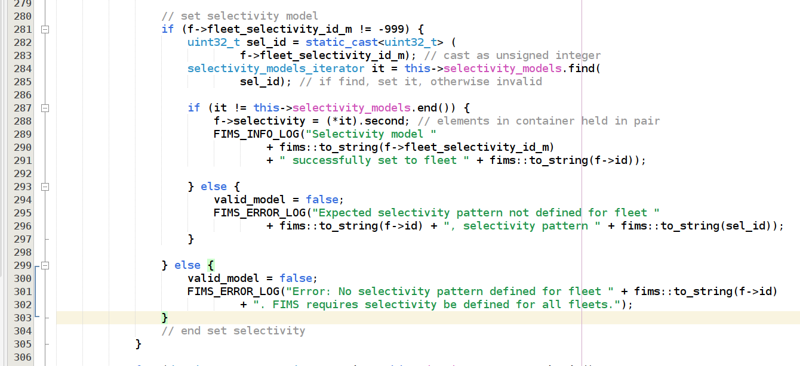
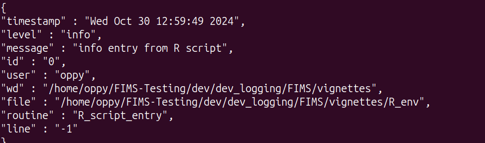
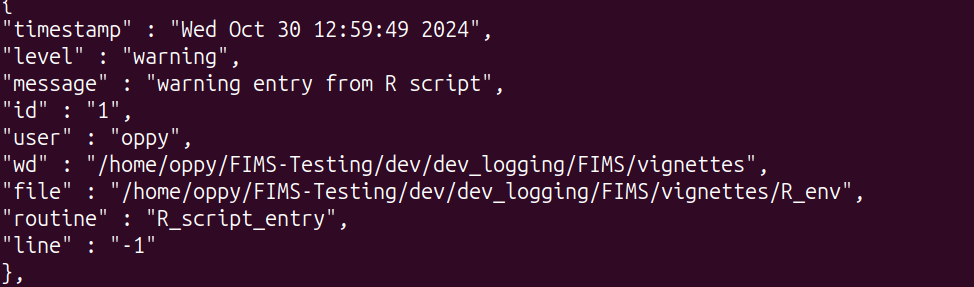
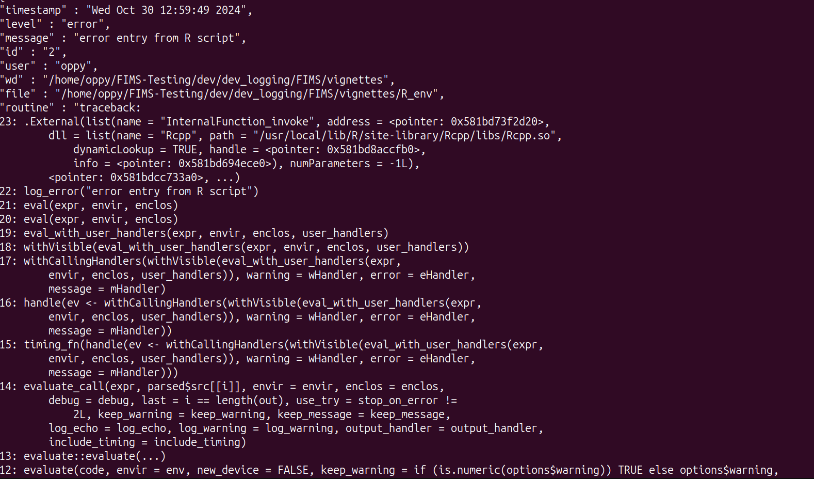

```{r colorize, include=FALSE}
library(FIMS)
library(TMB)
library(jsonlite)

colorize <- function(x, color) {
  if (knitr::is_latex_output()) {
    sprintf("\\textcolor{%s}{%s}", color, x)
  } else if (knitr::is_html_output()) {
    sprintf("<span style='color: %s;'>%s</span>", color, x)
  } else {
    x
  }
}

# clear memory
clear()

# use FIMS data frame
fims_frame <- FIMSFrame(data_mile1)
fleet1 <- survey1 <- list(
  selectivity = list(form = "LogisticSelectivity"),
  data_distribution = c(
    Index = "DlnormDistribution",
    AgeComp = "DmultinomDistribution"
  )
)

# Create default parameters
default_parameters <- fims_frame |>
  create_default_parameters(
    fleets = list(fleet1 = fleet1, survey1 = survey1),
    recruitment = list(
      form = "BevertonHoltRecruitment",
      process_distribution = c(log_devs = "DnormDistribution")
    ),
    growth = list(form = "EWAAgrowth"),
    maturity = list(form = "LogisticMaturity")
  )
```

## Importance of Logging 

Logging in FIMS is important because it allows developers to understand what is happening within a model. It is especially useful when problems arise. The FIMS logging system has been designed to handle common issues, such as undefined modules, dimension issues, and software errors that may occur when a model is not properly defined. This logging system is accessible from both R and C++ and messages are provided in a easy to read JSON format.

## How FIMS Logging works

At run time, logging messages are stored in a C++ structure called LogEntry. This structure contains useful information, such as information regarding when the LogEntry was created and what portion of the code initiated its creation. For details regarding the contents of a LogEntry see the doxygen documentation. All of the LogEntry(s) are stored in a log file that can be accessed from within your R environment or are written to the disk upon failure of R to successfully communicate with C++.

## Backend C++ Specification

The logging system (specified in inst/include/common/def.hpp) provides three useful macro functions for creating log entries, **`r colorize("FIMS_INFO_LOG", "blue")`**, **`r colorize("FIMS_WARNING_LOG", "blue")`** , and **`r colorize("FIMS_ERROR_LOG", "blue")`**. These macros take a single string value as an argument, the rest is handled internally. Therefore, the developer only needs to worry about specifying the message and the macros take care of capturing all the other elements of the log entry. For example, **`r colorize("FIMS_INFO_LOG", "blue")`** is used quite a bit in information.hpp to let the user know that items were initialized appropriately. Developers can specify the information contained within the string passed to the macro to be generic or specific to values stored inside the C++ code. See below for an example of a generic message that is completely specified by the user and a more specific message that uses information stored within C++ for part of the message. Also, note that the C++ function **`r colorize("fims::to_string", "blue") `** converts a numeric value to a string, making it additive to the message.

```{Rcpp, eval = FALSE}
FIMS_INFO_LOG("Starting to initialize the fleet structures")
FIMS_INFO_LOG("Initializing fleet " + fims::to_string(f->id))
```

Below is a real-world example of a log entry that was created while running a FIMS model due to the **`r colorize("FIMS_INFO_LOG", "blue")`** within the selectivity module. The log entry specifies the line of the file with the macro that led to the log entry and below we show screenshots of both the file and the resulting log entry within a log.




Additionally, if FIMS has been compiled with the **`r colorize("-DFIMS_DEBUG", "blue")`** pre-processing macro, output from the **`r colorize("FIMS_DEBUG_LOG", "blue")`** macro will also be available in the log file, allowing developers a more interactive developing experience. The output from this macro is turned off in the main branch, and thus, the macro is not available to the typical user to stop debugging statements from polluting the log file.

## Using the Logging System in R

The FIMS Logging System is also available from R, with a caveat! Logging from R gives less information than logging from C++. When a log entry originates from R, file, routine, and line information are absent. Further implementations may rectify this issue. Below are examples of adding log entries from R.


```{r rlogging_info, results="hide"}
log_info("info entry from R script")
```

```{r rlogging_warnings, results="hide"}
log_warning("warning entry from R script")
```

```{r rlogging_error, results="hide"}
log_error("error entry from R script")
```


In the above example of an error level log entry, notice the R stack trace in the 
routine field. Sometimes this may contain useful information, but most of the time the stack 
trace is to large to capture the root cause of the error. For that reason, it's advised 
to make the error message as detailed as possible when calling **`r colorize("log_error(x)", "blue") `** 
from R. 

The logging system provides several useful functions. Below is a description of each.

### **FIMS Logging Functions in R**

* **log_info(x)** - add a info level log from R.
* **log_warning(x)** - add a warning level log from R.
* **log_error(x)** - add a error level log from R.
* **get_log()** - returns the whole log as a string.
* **get_log_info()** - returns only the info level log entries as a string.
* **get_log_warnings()** -  returns only the warning level log entries as a string.
* **get_log_errors()** -  returns only the error level log entries as a string.
* **get_log_module(name)** -  returns only the log entries from a particular module as a string.
* **set_log_path()** -  sets the path for the log to be written.
* **write_log(x)** -  if x is true, the log file will be written on exit, otherwise no log will be written. Default = TRUE.
* **set_log_throw_on_error** - throws an exception and terminates the model run if a error is logged.


## Example of FIMS logging from R

Assuming a model has already been defined, below is an example of using the logging system with FIMS in R.

```{r example_code, eval = TRUE}
success <- CreateTMBModel()

if (!success) {
  log_error("FIMS failed to create TMB model")
} else {
fit <- default_parameters |>
  initialize_fims(data = fims_frame) |>
  (\(parameter_list) list(parameters = parameter_list, version = "FIMS run with optimization"))() |>
  fit_fims(optimize = TRUE)
}

# get the log as a string in JSON format and parse into a list
log_str <- as.character(get_log())
write(log_str, "log.json")
log_json <- jsonlite::fromJSON(log_str)

# #write the log string to the console
# cat(log_str)
# 
# #get log warnings only
log_warnings_str <- get_log_warnings()
# 
# #get log errors only
log_errors_str <- get_log_errors()
# 
# #get log entries from the information module
information_log <- get_log_module("information")
```

Another useful option is the  **`r colorize("set_throw_on_error", "blue")`** function.
If this option is set to TRUE, FIMS will abort immediately when an error occurs and
if the  **`r colorize("write_log", "blue")`** option is set to TRUE, the log file
will be written before FIMS terminates the session. Below is an example of throwing
on error.

```{r throw, eval = FALSE}
set_log_throw_on_error(TRUE)

log_error("throwing now!")

```

